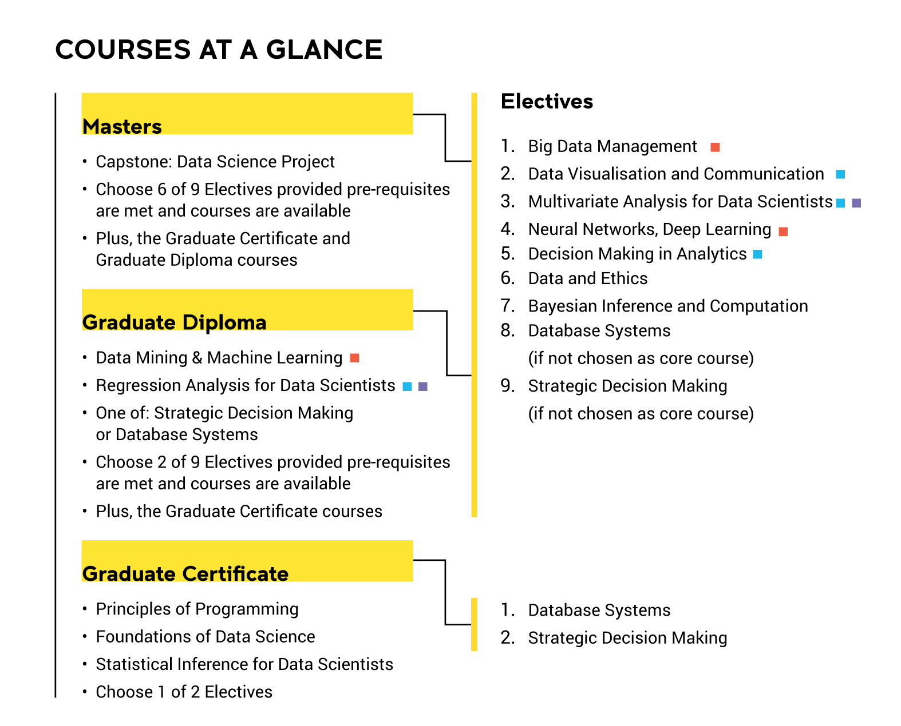

I've started my Masters Coursework - [Master of Data Science](https://studyonline.unsw.edu.au/online-programs/master-data-science) from UNSW on Jan 2023. The program will be 15 courses (this includes the 3 pre-requisites), plus the Capstone Project to conclude the coursework.

### Complete list of courses
<figure>
	<figcaption>Master of Data Science at UNSW</figcaption>
</figure>

It has been organised as a full online workflow using the popular learning platform [Moodle](https://moodle.org/), and conveniently configured as Hexamesters, with 6 teaching terms per year, where a student will enroll in 1 course per term.
All in all, if I don't miss a teaching term, it will take me a little over 2 years to complete the whole program.

