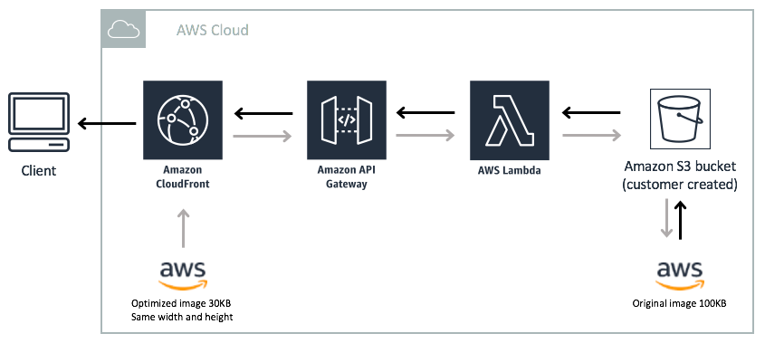

<section id="table-of-contents">
  <header>
    <h3>Overview</h3>
  </header>
  

  *  Auto generated table of contents
  {:toc}
  

</section>

## Why an image handler

If you are within the AWS infrastructure there is this ready-made solution created by [AWS Labs](https://aws.amazon.com/solutions/) that your website or mobile application can use to improve user experience and prevent high bounce rates. 

Typically when serving image files, website usually have several versions of each image (different resolutions to cater for different image sizes), but this process lends itself to being slow and error prone. This process is also hard to manage, and when there are thousands of files, it can be a nightmare when the time comes when things need to be updated. 

Because there is a need for a highly available, fast, and low-cost product, AWS Labs have developed a solution based on AWS, and open source imaging service called [Thumbor](https://thumbor.readthedocs.io/en/latest/#).

<figure>
	
	<figcaption>Figure 1: AWS Serverless Image Handler solution</figcaption>
</figure>

## AWS Serverless Image Handler solution

The following make up the AWS Serverless Image Handler solution:

- **AWS S3 Bucket** - you store your original images in your own S3 bucket. You don't have to expose them to the public if you don't want to.
  
- **AWS Lambda** - your Thumbor service lives in a Lambda, this will do the image processing for you. In addition to downscaling (or even upscaling) your images, Thumbor makes available all these [filters](https://thumbor.readthedocs.io/en/latest/filters.html) for you to use!
   
- **AWS API Gateway** - to expose the Lambda to the world, you need the API Gateway.
  
- **AWS Cloudfront** - your image handler now gets low-latency and high availability through AWS Cloudfront CDN.  

## How to Install

Just head to the official AWS links at [Serverless Image Handler](https://aws.amazon.com/solutions/serverless-image-handler/), there you will find instructions:

- use a Cloudfront template to get it up and ready to use in 25 minutes. It took me 30 minutes, so it's spot on. 
- customizations if you need them
- the Thumbor-based Lambda service's [source code is also available](https://github.com/awslabs/serverless-image-handler)
- a UI component is optionally available to help you get familiar with it's usage
- AWS also prepared a [PDF Deployment Guide](https://s3.amazonaws.com/solutions-reference/serverless-image-handler/latest/serverless-image-handler.pdf) as a simple step-by-step guide that you can follow

## Summary

An Image Handler is a common requirement for optimizing your websites and mobile applications. There are commercial solutions available, or you can opt to do it yourself from scratch. However there is no need to do that if a ready-made and production-ready solution is available right now.

The AWS Serverless Image Handler is a serverless solution that is optimized for dynamic image manipulation on the AWS Cloud infrastructure. 

## Resources
- [Serverless Image Handler](https://aws.amazon.com/solutions/serverless-image-handler/)
- [Lambda Source Code](https://github.com/awslabs/serverless-image-handler) 
- [Deployment Guide - PDF](https://s3.amazonaws.com/solutions-reference/serverless-image-handler/latest/serverless-image-handler.pdf)
- [Deployment Guide - Web](https://docs.aws.amazon.com/solutions/latest/serverless-image-handler/welcome.html)
  
