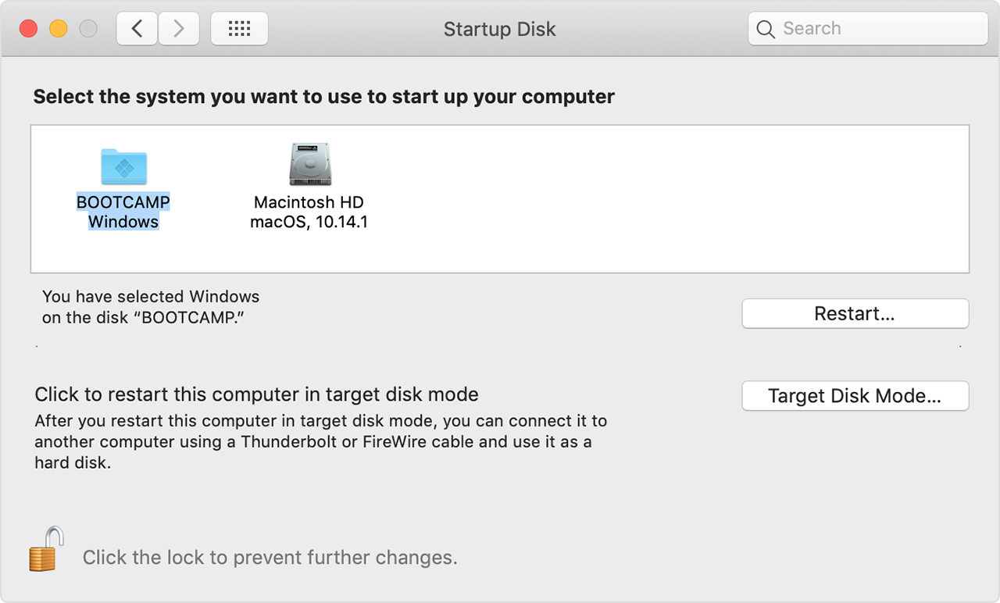

<section id="table-of-contents" class="toc">
  <header>
    <h3>Overview</h3>
  </header>
  <div id="drawer" markdown="1">
  *  Auto generated table of contents
  {:toc}
  </div>
</section>

## Synopsis
- a local Umbraco-based dev environment can be combined with Docker to achieve a portable option that can be easily be shared among the developers in your team
- we have to use Docker using Windows containers since Umbraco is a 'traditional' web application based on .Net and not .Net Core, and thus will not work on the more efficient and compact Linux containers
- start with a empty Web Application using .Net 4.7.2 (because we will be using the latest Umbraco 8 in the next step)
- then add Umbraco 8 to the solution using Package Manager
- modify the docker-compose.yml to add a dependency on the SQL database which we also host in a Docker container in the same network
- add a volume so that you can persist data to disk (and move this to another machine - portability)
- this whole exercise will cost us about 25GB of space. Docker images are disk space hungry, and Windows images in particular. /mssql-server-windows-developer is about 15GB compared to and equivalent in a Linux container of ~6 GB. And Windows containers are slower too. 
- Running the VS solution will build the images, build the website and run the them in their own containers. Cleaning the VS solution will stop running all things inside the solution, including tearing down all running containers. It actually does a docker-compose down so it tear eerything down, just like nothing happened. <Write the implications of this for an Umbraco project.>
- In this version, you will have to manually create the empty SQL DB yourself. At Umbraco installation, just use this newly created empty database insted of the Umbraco default SQLCE DB. 
- If you want to persist your Umbraco DB (so that docker-compose downs will not destroy Umbraco), please add the commented out volumes declarations in the docker-compose file
- NOTE: you will have to manually update UmbracoDBSN to use the IP address of umbraco-sqldb since there is an existing bug in windows containers wherein you cannot use localhost.
- when a new developer starts or you want to setup in a new machine, just get the source code, and the mdf, and ldf files. Build the solution, run, manually update UmbracoDBSN connection string to use IP address, and you should be set. <Note that disk based artifacts like media files, are not covered in this, and these may be covered by another volume, and is beyond the scope of this post> 

## Docker containers


After it's release in 2013, the popularity of [Docker](https://www.docker.com/) has grown through the years. It allowed one to run software in containers - a virtualization technology which is comparable to virtual machines in its practical use. However, unlike virtual machines, it is much more compact, and more dynamic in its resource usage where you do not have to permanently set aside hardware for it. It enables portability where we can define images which are self contained, with all the dependencies it needs.

These Docker images are portable in that we can distribute them for others to run and get exactly the same behaviour everywhere, without the need to manually install all the elements that make up the image. The time savings is clear when you don't have to wait through all the number of installations that make up the single image. And you get the exact same running container as what the image creator had intended. 

There are many uses of Docker, but for this post, we will focus on it being a perfect candidate to use in a development team, to help in develoment environment standardization. In addition to that, when you work in a team, there is nothing more frustrating than trying to fix a bug and in the end find out that it was caused by a slightly differing configuration between developers. Using containers will make sure that all developers are working on the same environment. And because we are using containers, we can easily setup a new developer, and get them up and contributing quickly.

## Umbraco


[Umbraco](https://umbraco.com/) is a .Net based CMS (Content Management System) and started much earlier in 2000 and even though it has had multiple versions ever since, its architecture has not changed much. Umbraco has proved its longevity in the industry, and remains as one of the most popular .NET based CMS for developers. So in comparison to Docker, an Umbraco-based website is a traditional application. But that cannot stop us from taking advantage of the benefits of Docker and combine it with the utility of Umbraco.

## Docker and Umbraco together

Umbraco is a .NET application (not .NET Core) first and foremost, and that is our main requirement. Docker was designed for Linux, but because it is not .NET Core, we cannot Linux containers here, however Docker also has support for Windows containers. Their support for Windows is getting better although they are still not at par with the capabilities of their Linux cousins.

We will be using Docker Compose to define our system, which will have 2 parts (or services as per docker-compose lingo). The first service is the Umbraco DB - an SQL based database which is the center of an Umbraco project. The second service is the .NET based website that houses the Umbraco system. Both services are defined in a docker-compose.yml as we'll see in the next section. This defines our system, the portable system that we can pass around our development team.

... Insert image of docker-compose system here...

## How to create a Docker-based Umbraco web application 
1. Start by creating an ASP .NET Web application based on .NET Framework 4.7.2. Since we will be using Umbraco 8 with which 4.7.2 is a dependency.
    <figure>
	    <a href="../images/umbraco-and-docker/umbraco-docker-1.PNG"></a>
	    <figcaption>Figure: ASP .NET Web Application</figcaption>
    </figure>

1. Create an empty Web Application with Docker Compose support, like so:
    <figure>
	    <a href="../images/umbraco-and-docker/umbraco-docker-2.PNG"></a>
	    <figcaption>Figure: Enable Docker Compose support</figcaption>
    </figure>

1. Add UmbracoCms v8.0.1 nuget package through the Nuget Package Manager, and install it to the application, and allow it to finish. 
    <figure>
	    <a href="../images/umbraco-and-docker/umbraco-docker-4.PNG"></a>
	    <figcaption>Figure: Add UmbracoCms 8.0.1 package</figcaption>
    </figure>

1. After the UmbracoCms nuget package installation, you need to update the docker-compose.yml file to add **umbraco-db** - the service that will contain our Dockerized SQL DB. Also we need to add **umbraco-db** as a dependency of **umbracodocker**.
    ```yaml
    version: '3.4'
    services:
      umbraco-db:
        build:
          context: ..\DevEnvironment\umbraco-db
        container_name: umbraco-sqldb
        volumes:
          - C:\ProgramData\Docker\volumes\umbraco-volume:C:\volumes
        ports:
          - "1433:1433"
        environment:
          SA_PASSWORD: "StrongP@ssw0rd!"
          ACCEPT_EULA: "Y"
          # attach_dbs: "[{'dbName':'umbraco-cms','dbFiles':['C:\\\\volumes\\\\umbraco-cms.mdf','C:\\\\volumes\\\\umbraco-cms_log.ldf']}]"
        image: microsoft/mssql-server-windows-developer
        networks:
          - default
      umbracodocker:
        image: ${DOCKER_REGISTRY-}umbracodocker
        depends_on:
          - umbraco-db
        build:
          context: .\UmbracoDocker
          dockerfile: Dockerfile
    ```
    After doing so, you can now run the web application by Ctrl-F5:
> **Tip #1** - To run the website, do a Ctrl-F5 (Start without debugging). Also make sure that you have the "docker-compose" project as the startup project. Doing so will run docker-compose on it, running all the containers defined in the compose file, and open a browser with  Umbraco ready for configuration. There seems to be a problem with Visual Studio if you chose to debug it using F5 (Start Debugging).
> <figure>
> 	<a href="../images/umbraco-and-docker/error-when-debugging.PNG"></a>
> 	<figcaption>Figure: 403 error when debugging</figcaption>
> </figure> 

1. If you the type **docker ps -a** on the terminal window, to check on the running containers, you will see 2 containers running, one is for the Umbraco SQL DB, and the other one is our Umbraco Web application:
    <figure>
	    <a href="../images/umbraco-and-docker/umbraco-install-4.jpg"></a>
	    <figcaption>Figure: Check our running containers</figcaption>
    </figure>
> **Tip #2** - Running Windows-based containers require Hyper-V enabled on your PC through a BIOS setting. However in a Bootcamp partition on a Mac like mine, there is no BIOS setting. The workaround for this to first boot up into your Mac. Choose Apple menu > System Preferences, then click Startup Disk. Click the lock icon and enter your administrator password. Select your Windows partition as the startup disk, then restart by clicking the "Restart" button next to it. This is important I think, as it enables the hardware virtualization mode, even after you reboot to the Windows partition. What a hack.
> <figure>
> 	<a href="../images/umbraco-and-docker/macos-sierra-system-startup-select.png"></a>
> 	<figcaption>Figure: Setting Windows as startup partition</figcaption>
> </figure>

1. After Ctrl-F5, you should see the Umbraco web application running, prompting you to complete the installation. Fill in the details and click on Customize button. We want to avoid using default Windows CE DB, but our own Dockerized DB we created today.
    <figure>
	    <a href="../images/umbraco-and-docker/umbraco-install-1.jpg"></a>
	    <figcaption>Figure: Completing the Umbraco installation</figcaption>
    </figure>

1. Input **Microsoft SQL Server** as the database type, find and input the DB Server IP Address, manualy create **umbraco-cms** DB with Management Studio and enter the Database name in the form. Input the Login user, and Password and click on the Continue button. This should then proceed with the final steps for the installation, and the final page should then be the following, yes we've successfully installed Umbraco!
    <figure>
	    <a href="../images/umbraco-and-docker/umbraco-install-2.jpg"></a>
	    <figcaption>Figure: Completing the Umbraco installation</figcaption>
    </figure>

1. Umbraco installation completed!
    <figure>
	    <a href="../images/umbraco-and-docker/umbraco-install-3.jpg"></a>
	    <figcaption>Figure: Umbraco installation completed!</figcaption>
    </figure>    
      

## Explore further
Content here

## Summary
Content here

## Resources
- [Understanding Docker with Visual Studio 2017](https://www.scrum-tips.com/2017/12/27/understanding-docker-with-visual-studio-2017-part-2/)
- [Official Docker Compose Reference](https://docs.docker.com/compose/overview/)
- [Modernize with Azure and Containers](https://docs.microsoft.com/en-us/dotnet/standard/modernize-with-azure-and-containers/)
- [Umbraco, Docker and Kubernetes, Should we care?](https://skrift.io/articles/archive/umbraco-docker-and-kubernetes-should-we-care/)


 

> **Tip #3** - Running Windows-based containers require Hyper-V enabled on your PC through a BIOS setting. However in a Bootcamp partition on a Mac, there is no BIOS setting. The workaround for this to first boot up into your Mac. Choose Apple menu > System Preferences, then click Startup Disk. Click the lock icon and enter your administrator password. Select your Windows partition as the startup disk, then restart by clicking the "Restart" button next to it. This is important I think, as it enables the hardware virtualization mode, even after you reboot to the Windows partition. What a hack.
> <figure>
> 	<a href="../images/umbraco-and-docker/macos-sierra-system-startup-select.png"></a>
> 	<figcaption>Figure: Setting Windows as startup partition</figcaption>
> </figure>


## Gotchas
- Do a Ctrl+F5 to do a Run without debugging as debugging does not work with Docker for now. 
- To enable Virtualization to work on a Bootcamp Windows 10, you have to go back to Mac, and in Startup disk choose the Windows Bootcamp partition, then choose Restart. The restart button is importatnt, that is the only way to switch virtualization ON.
- In the docker run commnd, I did `
docker run -d -p 1433:1433 -e sa_password=StrongP@ssw0rd! -e ACCEPT_EULA=Y microsoft/mssql-server-windows-developer -v C:\ProgramData\Docker\volumes:C:\umbraco-volume` however this is wrong and will result in an error like so: `> docker run -d -p 1433:1433 -e sa_password=StrongP@ssw0rd! -e ACCEPT_EULA=Y microsoft/mssql-server-windows-developer -v C:\ProgramData\Docker\volumes:C:\umbraco-volume
02f2dd5042d3ce921dcdcb553d625c4c6874e3189603555db5af6a6aa013d449
C:\Program Files\Docker\Docker\Resources\bin\docker.exe: Error response from daemon: container 02f2dd5042d3ce921dcdcb553d625c4c6874e3189603555db5af6a6aa013d449 encountered an error during CreateProcess: failure in a Windows system call: The system cannot find the file specified. (0x2)
[Event Detail:  Provider: 00000000-0000-0000-0000-000000000000] extra info: {"CommandLine":"-v C:\\ProgramData\\Docker\\volumes:C:\\umbraco-volume","WorkingDirectory":"C:\\","Environment":{"ACCEPT_EULA":"Y","attach_dbs":"[]","sa_password":"StrongP@ssw0rd!","sa_password_path":"C:\\ProgramData\\Docker\\secrets\\sa-password"},"CreateStdInPipe":true,"CreateStdOutPipe":true,"CreateStdErrPipe":true,"ConsoleSize":[0,0]}`
  
