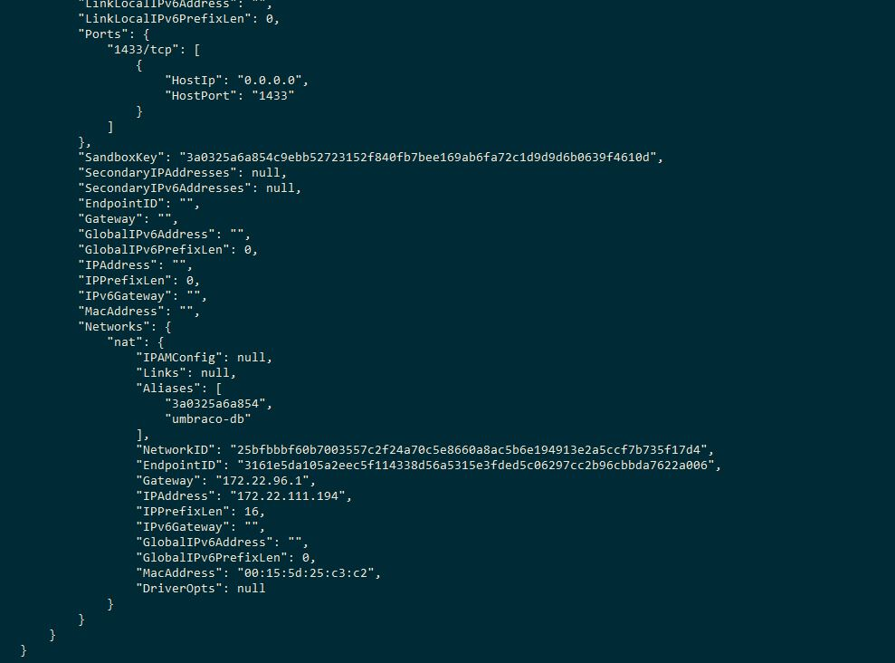

<section id="table-of-contents" class="toc">
  <header>
    <h3>Overview</h3>
  </header>
  <div id="drawer" markdown="1">
  *  Auto generated table of contents
  {:toc}
  </div>
</section>

## Past meets the present (or future?)

Today we will be invetigating how we can bring a traditional web application to the present/future by making it work with Docker containers.  We will be using a typical Umbraco MVC app, which thousands of websites are built with, and so many developers love. I know it's not the latest and sexiest technology out there, however wait until you see it with Docker. 

There may be plans to [migrate Umbraco to .NET Core (host in Linux, yay)](https://growcreate.co.uk/blog/umbraco-review-2017-developing-websites-with-umbraco/), but until then we are stuck with Windows and IIS. Without further delay, let's get the ball rolling!

## Docker containers


After it's release in 2013, the popularity of [Docker](https://www.docker.com/) has grown through the years. It allowed one to run software in containers - a virtualization technology which is comparable to virtual machines in its practical use. However, unlike virtual machines, it is much more compact, and more dynamic in its resource usage where you do not have to permanently set aside hardware for it. It enables portability where we can define images which are self contained, with all the dependencies it needs.

These **Docker images are portable** in that we can distribute them for others to run and get exactly the same behaviour everywhere, without the need to manually install all the elements that make up the image. The time savings is clear when you don't have to wait through all the number of installations that make up the single image. And you get the exact same running container as what the image creator had intended. 

There are many uses of Docker, but for this post, we will focus on it being a perfect candidate to use in a development team, to help in **develoment environment standardization**. In addition to that, when you work in a team, there is nothing more frustrating than trying to fix a bug and in the end find out that it was caused by a slightly differing configuration between developers. Using containers will make sure that all developers are working on the same environment. And because we are using containers, we can easily setup a new developer, and get them up and contributing quickly.

## Umbraco


[Umbraco](https://umbraco.com/) is a .Net based CMS (Content Management System) and started much earlier in 2000 and even though it has had multiple versions ever since, its architecture has not changed much. Umbraco has proved its longevity in the industry, and remains as one of the most popular .NET based CMS for developers. So in comparison to Docker, an Umbraco-based website is a traditional application. But that cannot stop us from taking advantage of the benefits of Docker and combine it with the utility of Umbraco.

## Docker and Umbraco together

Umbraco is a .NET application (not [.NET Core](https://github.com/dotnet/core)) first and foremost, and that is our main requirement. Docker was designed for Linux, but because it is not .NET Core, we cannot use Linux containers here, however Docker also has support for Windows containers. Their support for Windows is getting better although they are still not at par with the capabilities of their Linux cousins.

We will be using [Docker Compose](https://docs.docker.com/compose/) to define our system, which will have 2 parts (or services as per docker-compose lingo). The first service is the Umbraco DB - an SQL based database which is the center of an Umbraco project. The second service is the .NET based website that houses the Umbraco system. Both services are defined in a docker-compose.yml as we'll see in the next section. This defines our system, the portable image that we can pass around our development team.

## How to create a Docker-based Umbraco web application
>
> Source code for the following exercise is found [here](https://github.com/jaeyow/docker-umbraco).
>

1. Start by creating an ASP .NET Web application based on [.NET Framework 4.7.2](https://dotnet.microsoft.com/download/dotnet-framework/net472). Since we will be using Umbraco 8 with which 4.7.2 is a dependency.
    <figure>
	    <a href="../images/umbraco-and-docker/umbraco-docker-1.PNG"></a>
	    <figcaption>Figure: ASP .NET Web Application</figcaption>
    </figure>

1. Create an empty Web Application with Docker Compose support, like so:
    <figure>
	    <a href="../images/umbraco-and-docker/umbraco-docker-2.PNG"></a>
	    <figcaption>Figure: Enable Docker Compose support</figcaption>
    </figure>

1. Add UmbracoCms v8.0.1 nuget package through the Nuget Package Manager, and install it to the application, and allow it to finish. 
    <figure>
	    <a href="../images/umbraco-and-docker/umbraco-docker-4.PNG"></a>
	    <figcaption>Figure: Add UmbracoCms 8.0.1 package</figcaption>
    </figure>

1. After the UmbracoCms nuget package installation, you need to update the docker-compose.yml file to add **umbraco-db** - the service that will contain our Dockerized SQL DB. Also we need to add **umbraco-db** as a dependency of **umbracodocker**. The image we will be using for the Windows SQL Server is [microsoft/mssql-server-windows-developer](https://hub.docker.com/r/microsoft/mssql-server-windows-developer/), while the web application uses [microsoft/aspnet:4.7.2-windowsservercore-1803](https://github.com/Microsoft/aspnet-docker/tree/master/4.7.2-windowsservercore-1803);
    ```yaml
    version: '3.4'
    services:
      umbraco-db:
        build:
          context: ..\DevEnvironment\umbraco-db
        container_name: umbraco-sqldb
        volumes:
          - C:\ProgramData\Docker\volumes\umbraco-volume:C:\volumes
        ports:
          - "1433:1433"
        environment:
          SA_PASSWORD: "StrongP@ssw0rd!"
          ACCEPT_EULA: "Y"
          # attach_dbs: "[{'dbName':'umbraco-cms','dbFiles':['C:\\\\volumes\\\\umbraco-cms.mdf','C:\\\\volumes\\\\umbraco-cms_log.ldf']}]"
        image: microsoft/mssql-server-windows-developer
        networks:
          - default
      umbracodocker:
        image: ${DOCKER_REGISTRY-}umbracodocker
        depends_on:
          - umbraco-db
        build:
          context: .\UmbracoDocker
          dockerfile: Dockerfile
    ```
    After doing so, you can now run the web application by Ctrl-F5:
> **Tip #1** - To run the website, do a Ctrl-F5 (Start without debugging). Also make sure that you have the "docker-compose" project as the startup project. Doing so will run docker-compose on it, running all the containers defined in the compose file, and open a browser with  Umbraco ready for configuration. There seems to be a problem with Visual Studio if you chose to debug it using F5 (Start Debugging).
> <figure>
> 	<a href="../images/umbraco-and-docker/error-when-debugging.PNG"></a>
> 	<figcaption>Figure: 403 error when debugging</figcaption>
> </figure> 

1. If you the type **docker ps -a** on the terminal window, to check on the running containers, you will see 2 containers running, one is for the Umbraco SQL DB, and the other one is our Umbraco Web application:
    <figure>
	    <a href="../images/umbraco-and-docker/umbraco-install-4.JPG"></a>
	    <figcaption>Figure: Check our running containers</figcaption>
    </figure>
> **Tip #2** - Running Windows-based containers require Hyper-V enabled on your PC through a BIOS setting. However in a Bootcamp partition on a Mac like mine, there is no BIOS setting. The workaround for this to first boot up into your Mac. Choose Apple menu > System Preferences, then click Startup Disk. Click the lock icon and enter your administrator password. Select your Windows partition as the startup disk, then restart by clicking the "Restart" button next to it. This is important I think, as it enables the hardware virtualization mode, even after you reboot to the Windows partition. What a hack.
> <figure>
> 	<a href="../images/umbraco-and-docker/macos-sierra-system-startup-select.png"></a>
> 	<figcaption>Figure: Setting Windows as startup partition</figcaption>
> </figure>

1. After Ctrl-F5, you should see the Umbraco web application running, prompting you to complete the installation. Fill in the details and click on Customize button. We want to avoid using default Windows CE DB, but our own Dockerized DB we created today.
    <figure>
	    <a href="../images/umbraco-and-docker/umbraco-install-1.JPG"></a>
	    <figcaption>Figure: Completing the Umbraco installation</figcaption>
    </figure>

1. Input **Microsoft SQL Server** as the **database type**, find and input the **DB Server IP Address**, manually create **umbraco-cms** DB with Management Studio and enter the **Database name** in the form. Input the **Login user**, and **Password** and click on the Continue button. This should then proceed with the final steps for the installation, and the final page should then be the following, yes we've successfully installed Umbraco!
    <figure>
	    <a href="../images/umbraco-and-docker/umbraco-install-2.JPG"></a>
	    <figcaption>Figure: Completing the Umbraco installation</figcaption>
    </figure>
> **Tip #3** - To find the IP address of a Docker container, type `docker inspect <containerId>`. The container's IP address will be displayed towards the bottom of the output.
> <figure>
> 	<a href="../images/umbraco-and-docker/umbraco-install-5.JPG"></a>
> 	<figcaption>Finding the container's IP address is easy</figcaption>
> </figure>    

1. If you followed all the instructions, your Umbraco installation should have completed successfully! Now you can go and give yourself a pat on the back. You now have a Docker-based development environment that you can distibute among your team to help you become productive in no time at all. 
    <figure>
	    <a href="../images/umbraco-and-docker/umbraco-install-3.JPG"></a>
	    <figcaption>Figure: Umbraco installation completed!</figcaption>
    </figure>    

## Explore further
- add full support for [volumes](https://docs.docker.com/storage/volumes/) to achieve data persistence. So even if you perform a `docker-compose down` you will retain the data written to by the running Docker container.

> **Tip #4** - You will have to manually update **UmbracoDBSN** to use the IP address of umbraco-db since there is an existing bug in windows containers wherein you cannot use localhost. Also if you want to load an existing *.mdf and *.ldf, you have to attach them in the docker-compose.yml using the **atach_dbs** environment varialble. I have commented it in the docker-compose file as a guide to you. And one more thing, you have to add the key to appSettings:
>```xml
><add key="Umbraco.Core.ConfigurationStatus" value="8.0.1" />
>```
>as Umbraco uses that key to mean that an installation has succeeded, and just load the DB in the mdf file. Otherwise, Umbraco will think that it is not yet installed and will proceed to the installation screens and that is not what we want.

- Note that disk based artifacts like media files, are not covered in this, and these may be covered by another article, and is beyond the scope of this post

- in addition to using Docker as a mechanism fo standardizing our development environment, why don't you go one step further. You can utilize Docker fully by leveraging on it's deployment capabilities, that is, deployment to your staging and production environments. Container orchestration software such as [Kubernetes](https://kubernetes.io/), [Docker Swarm](https://docs.docker.com/engine/swarm/) or [Terraform](https://www.terraform.io/).


## Summary
If you have reached this part, you have a patience of a monk. In this rather long article, we have explored the viability of using Docker containers as a strategy for making local dev environments easy to work with. When a new developer starts, it will be a breeze to just use the images and get them up and productive in no time. But it doesn't have to be just Umbraco projects. Docker containers can be used for many different types and classes of applications, old and new. Maybe in a later post we can continue where we left off and try our hand with orchestration software to extend our use of Docker for deployments too.

Until then, see ya. 

## Resources
- [Understanding Docker with Visual Studio 2017](https://www.scrum-tips.com/2017/12/27/understanding-docker-with-visual-studio-2017-part-2/)
- [Official Docker Compose Reference](https://docs.docker.com/compose/overview/)
- [Modernize with Azure and Containers](https://docs.microsoft.com/en-us/dotnet/standard/modernize-with-azure-and-containers/)
- [Umbraco, Docker and Kubernetes, Should we care?](https://skrift.io/articles/archive/umbraco-docker-and-kubernetes-should-we-care/)
- [Source code for this article](https://github.com/jaeyow/docker-umbraco)