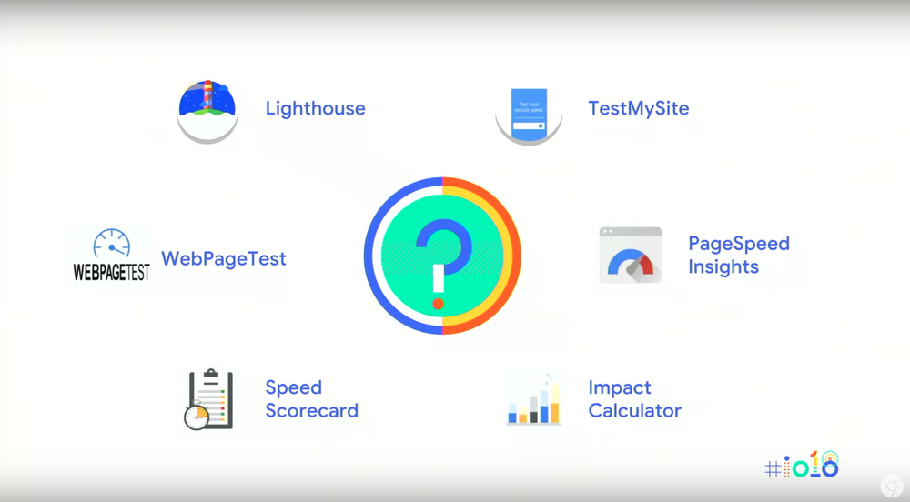
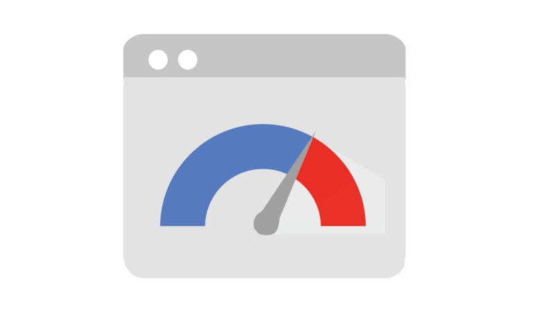
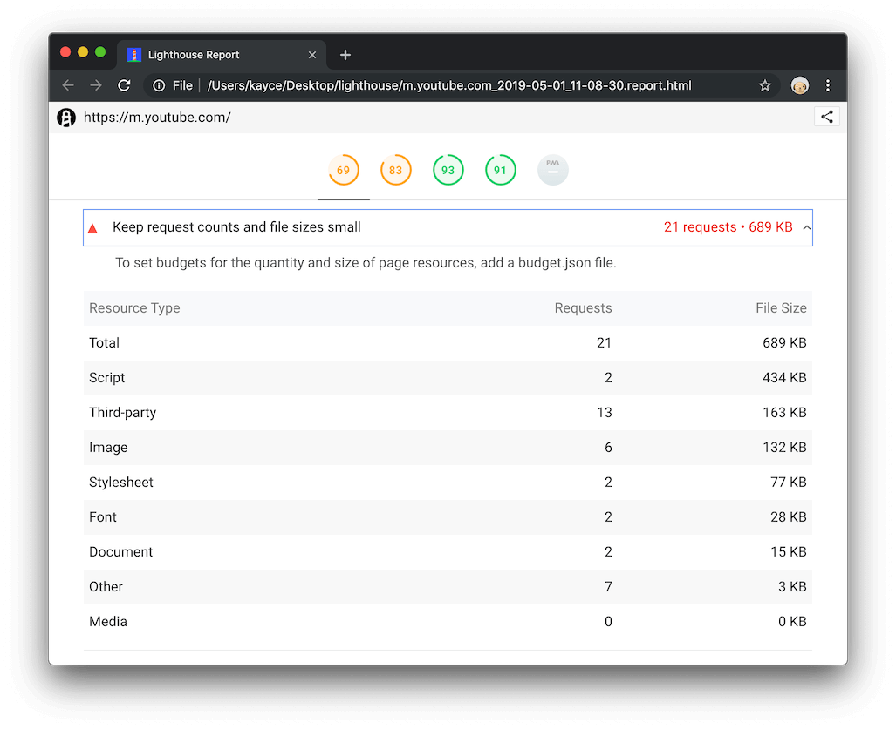
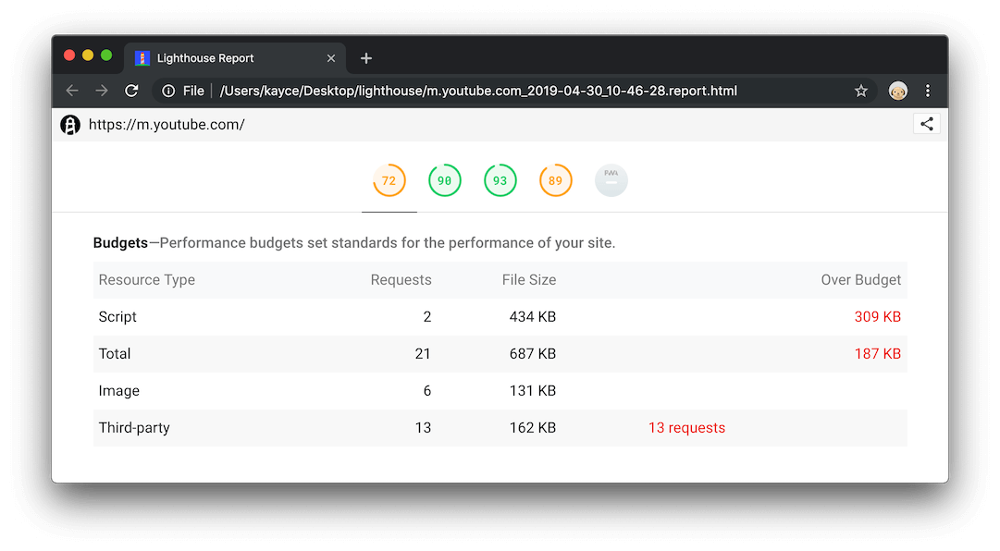

<section id="table-of-contents" class="toc">
  <header>
    <h3>Overview</h3>
  </header>
  

  *  Auto generated table of contents
  {:toc}
  

</section>

## Improve Site Performance
In the previous article, [Website Performance Series - Part 1](https://jaeyow.github.io/fullstack-developer/website-performance-series-part-1/), we've seen how a slow-loading website can have an adverse effect on your page's conversions. This will lead to an increase in your visitor's frustration prompting them to abandon your site for your competitor's.

For the rest of this series, we will be talking about techniques to **improve website performance**, and **NOT** techniques for website optimization (using tools such as [Optimizely](https://www.optimizely.com), [Adobe Target](https://www.adobe.com/au/marketing/target.html) and [Google Optimize](https://optimize.google.com/optimize/home/)). These tools are mainly used by marketing teams for experimentation to increase page and site conversions. Typically, you will only start optimizing your website with these tools once you have maximized your site's loading speed. 

> Although these tools may ultimately improve page conversions, they may have a negative effect and can actually slow down your page to some extent, so it may be a counter-intuitive exercise, and best left to be discussed in more detail perhaps in a future post. 

## Discover your performance gaps
Google has produced several tools to help you discover gaps in your site performance. Because ultimately your site was designed with for an audience, and not just for one person, your site performance may be highly variable due to many factors and multitude of users.

<figure>
	<figcaption>Figure: Tools used for finding gaps in web performance</figcaption>
</figure>

Visitor's devices and network latency can affect your site performance however this might not be always obvious in a lab environment.

Google has built tools that can collect both **lab data** for discovering fundamental performance issues and **field data** for identifying real-world performance. Here's a link to the following [Google Speed Tools](https://developers.google.com/web/fundamentals/performance/speed-tools/) which contains a guide on usage. 

Using a combination of these tools like [Lighthouse](https://developers.google.com/web/tools/lighthouse), [PageSpeed Insights](https://developers.google.com/speed/pagespeed/insights/) and [Test My Site](https://www.thinkwithgoogle.com/feature/testmysite/) can give you a pretty good idea of your site's performance in all sorts of environments, and present you with suggestions to improve. The idea is you can run these tools repeatedly as you improve your site. 

<figure>
	<figcaption>Tool: PageSpeed Insights by Google</figcaption>
</figure>

> PageSpeed Insights combines tests from Lighthouse (for lab data) and [Chrome User Experience Report](https://developers.google.com/web/tools/chrome-user-experience-report) (for real-world field data) on both mobile and desktop devices and provides suggestions on how things can be improved. 

<figure>
	<figcaption>Tool: Lighthouse by Google</figcaption>
</figure>

> Lighthouse is a tool that you can run against your site as it performs audits against performance, accessibility, PWAs and more.
>
> It can be installed as a CLI and has a neat feature called [LightWallet](https://web.dev/use-lighthouse-for-performance-budgets#targetText=Use%20Lighthouse%20for%20performance%20budgets&targetText=Lighthouse%20now%20supports%20performance%20budgets,and%20quantity%20of%20page%20resources.) which allows you to create a **performance budget** to enable you to set build pass, warning or failure as you push your code through your CI/CD. 

## Setting your performance budget
It's great to be able to run all these tools to help us improve our sites, however, if we don't persist with these efforts, we will easily regress over time.

What's good about Lighthouse is that you can add [performance budgets](https://developers.google.com/web/tools/lighthouse/audits/budgets) and can easily build this into your CI/CD system. Anytime you go close or get over your set budget, you will know immediately, the fast feedback is there for one to take immediate action. This audit is called *Keep Request Counts Low And File Sizes Small*.
<figure>
	<figcaption>Keep Request Counts Low And File Sizes Small audit</figcaption>
</figure>

<figure>
	<figcaption>And if you have specified a budget file, you will know your budget status</figcaption>
</figure>
  
## Conclusion

## Resources
- [Google Speed Tools](https://developers.google.com/web/fundamentals/performance/speed-tools/)
- [Tools For Web Developers](https://developers.google.com/web/tools)

  
