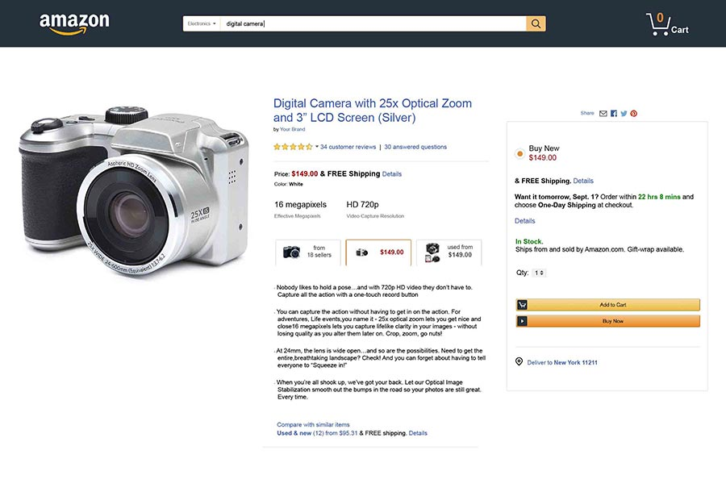
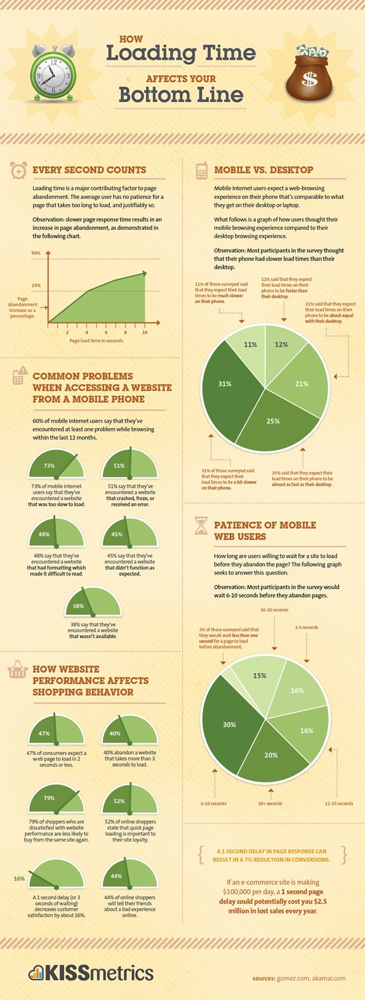

<section id="table-of-contents" class="toc">
  <header>
    <h3>Overview</h3>
  </header>
  

  *  Auto generated table of contents
  {:toc}
  

</section>

## Why web performance matters
A webpage (and the website it belongs to) is created to serve a particular purpose for the business.

For example a product page that sells digital cameras has the primary purpose of getting the visitor to click on the **add to cart** button, and eventually buying it.
<figure>
	<figcaption>Figure: Amazon product detail page</figcaption>
</figure>
A contact page is designed to direct the visitor how to get in contact with customer support to solve issues they are facing. 
<figure>
	<figcaption>Figure: HubSpot contact page</figcaption>
</figure>

Slower page response times results in a decrease in conversion rate and increase in page abandonment. The longer it takes for the page to load, the more chance for the visitor to abandon the page and possibly visit the competitor's offering. This means that without changing anything in the site other than improving page response times, we could potentially improve the conversion rate, and thus your bottom line. 

There are many factors affecting page load speed, and we will discuss these in more detail in future posts, however, according to the following infographic here is what a slow loading site might mean to your business.

<figure>
	<figcaption>Figure: How loading time affects your bottom line</figcaption>
</figure>

-  A 1 second delay in page response can result in a 7% reduction in conversions.
-  A 1 second delay decreases customer satisfaction by 16%
-  A 1 second page delay could potentially cost you $2.5 million in lost sales every year for a $100,000 per day site

## Conversion Rate and Page Traffic (and SEO)
**Web page conversion** is when the visitor takes the target action that the developer wanted them to take. It's not really always getting the visitor to buy something as web pages can serve different purposes.

For example, a product detail page from Amazon's definition of a conversion may be a customer purchase. A dentist's book-an-appointment page's conversion is defined as the successful booking on an appointment through the page. Conversion rate is the percentage of successful conversion out of 100 visitors. Say for example out of 100 page visits, if there are 2 clicks to Amazon's buy now button, then the page's conversion rate is 2%.

This is really simple maths, if we increase **page traffic** to 200, then we will have 4 potential buys. The problem is that we cannot infinitely increase the page traffic. It is more realistic to increase the conversion rate and given the same page traffic, have more successful conversions. So in this example, given the same 100 visitors, if we improved the conversion rate to 4%, we will now have 4 successful purchases, an increase compared to when our conversion rate was at 2%.

Now we haven't even mentioned **SEO** yet. To optimize a website for Search engines, you can improve your page traffic as the search engines will want to serve your pages more, thus increasing your bottom line. If you have sound SEO practices, your conversion rates will also increase as these practices tend to improve your site organization making the page simpler and more favorable to navigate. 

## This is interesting stuff
Having been developing software for a while, most of my projects in the past have never been public facing pages with emphasis on optimizing conversion rates (come to think of it, they have not been websites at all).

However, it would be awesome to be in a position to be able to positively influence the business' bottom line through their webpages. Because page metrics are easy to collect and understand, it is not that hard to have a go at conversion improvements, and receive timely feedback from them. It is imperative to setup these metrics before undergoing any attempts at improvement. Otherwise, it will be almost impossible to know if the introduced changes are having any positive effect.
  
## Conclusion
This post is the first of a series discussing the topic of web performance optimization through conversion rate, page traffic, and SEO improvements which are all separate topics in their own rights, however best implemented together like in a symphony to achieve the best outcome. This will be the point of view of a full stack developer. See you later. 

## Resources
- [Website Performance Conversion Rates](https://www.cloudflare.com/learning/performance/more/website-performance-conversion-rates/)
- [Optimizing Web Performance](https://speckyboy.com/optimizing-web-performance/)
- [How speed affects website](https://hostingtribunal.com/blog/how-speed-affects-website/)

  
