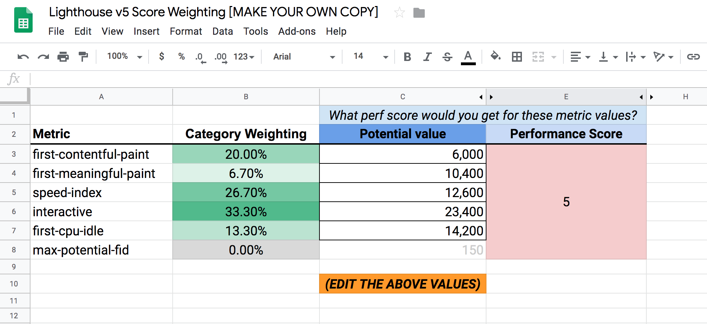

<section id="table-of-contents" class="toc">
  <header>
    <h3>Overview</h3>
  </header>
  

  *  Auto generated table of contents
  {:toc}
  

</section>

## Part of the Website Performance Series
[Part 1 - Why web performance matters and what that means to your bottom line](https://jaeyow.github.io/fullstack-developer/website-performance-series-part-1/)

[Part 2 - Tools for identifying performance gaps and formulating your performance budget](https://jaeyow.github.io/fullstack-developer/website-performance-series-part-2/)

[Part 3 - Speeding up your site is easy if you know what to focus on](https://jaeyow.github.io/fullstack-developer/website-performance-series-part-2/)

## Lighthouse Metrics (in weighted order of importance)
<figure>
	<figcaption>Tool: Lighthouse by Google</figcaption>
</figure>
To help web developers in their quest for a speedy site, Google brought us Lighthouse. You will at least need Chrome installed in your machine, and is available in a few workflows that suit you best. 

- *In Chrome DevTools.* Easily audit pages that require authentication, and read your reports in a user-friendly format.
- *From the command line.* Automate your Lighthouse runs via shell scripts.
- *As a Node module.* Integrate Lighthouse into your continuous integration systems.
- *From a web UI.* Run Lighthouse and link to reports without installing a thing.

Lighthouse has 5 important metrics that contribute to the final performance score. Each metric has different weights, as a result, those that have a heavier weight contribute more. The following describes each and their corresponding weights:

**Time to Interactive (TTI)** (weight 33.3%)
- TTI is the most important metric and is defined as the amount of time it takes for the page to become fully interactive. Interactivity is the point where:
    
    1) the page has started displaying some content,

    2) the visible page elements' event handlers have been registered, and

    3) the page can now respond quickly to user actions. 

- Techniques to improve TTI include [improving your Javascript startup](https://developers.google.com/web/fundamentals/performance/optimizing-content-efficiency/javascript-startup-optimization/), [Tree Shaking to eliminate dead code](https://developers.google.com/web/fundamentals/performance/optimizing-javascript/tree-shaking/),and [Code Splitting ](https://developers.google.com/web/fundamentals/performance/optimizing-javascript/code-splitting/) to serve the most important chunk first, and lazy load the rest as needed.

**Speed Index** (weight 26.7%)
- Speed Index shows how quickly the contents of a page are visibly populated, for this metric, the lower the number the better. 
- Techniques to improve Speed index are similar to ones for TTI, but a couple of good articles: [Optimizing Content Efficiency](https://developers.google.com/web/fundamentals/performance/optimizing-content-efficiency/) shows how modern web pages contain an increasing amount of data and techniques that can be applied for optimizing content efficiency. [Optimizing the Critical Rendering Path](https://developers.google.com/web/fundamentals/performance/critical-rendering-path/) will delve into techniques to deliver the first pixels to the screen as early as possible. 

**First Contentful Paint** (weight  20%)
- First Contentful Paint (FCP) marks the time at which the first text or image is painted. From when a user navigates to a page until such time that something appears on the DOM, this is FCP, and marks a milestone for the user and gives feedback that something is happening and the page is actually loading. The lower the metric the better. 
- Techniques to improve FCP are similar to TTI and SI as they try to achieve similar outcomes.
- The idea is to load early at the start, if nothing but to provide the illusion that the page is loading quickly. A few articles are worth reading: [CSS Rendering Best Practices](https://developers.google.com/web/fundamentals/performance/critical-rendering-path/render-blocking-css) explains the effect of CSS on your page and techniques on how to speed things up a bit. [Loading Third-party Javascript](https://developers.google.com/web/fundamentals/performance/optimizing-content-efficiency/loading-third-party-javascript/) gives some useful insights into 3rd party libraries such as tag manager and analytics software and the delays it contributes to the loading experience.

**First CPU Idle** (weight 13.3%)
- Blah

**First Meaningful Paint** (weight 6.7%)
- Blah

> **Tip #1 - The secret Lighthouse Calculator** - Well it's not really secret, but not many know about it's existence.
> 
> The [Lighthouse](https://developers.google.com/web/tools/lighthouse) team created a spreadsheet that can guide you in measuring and planning your speed improvements. The [Lighthouse v5 Score Weighting worksheet](https://docs.google.com/spreadsheets/d/1up5rxd4EMCoMaxH8cppcK1x76n6HLx0e7jxb0e0FXvc/edit#gid=283330180) (image below) is a tool that helps one understand the numbers to be aiming for to achieve a particular Lighthouse performance score.
> 
> To achieve a particular performance score, play with the values in the `Potential value` column (in milliseconds), and it will calculate the performance score taking into account the 5 metrics and its corresponding weights.
> 
> This is the same calculation that Lighthouse uses, so yeah it will prove handy in your mission to improve your site, and get the performance score you want, without guesswork. 
> 
> <figure>
> 	
> 	<figcaption>Figure: Lighthouse v5 Score Weighting Worksheet</figcaption>
> </figure> 
  
## Conclusion
This post is the first of a series discussing the topic of web performance optimization through conversion rate, page traffic, and SEO improvements which are all separate topics in their own rights, however best implemented together like in a symphony to achieve the best outcome. This will be the point of view of a full stack developer. See you later. 

## Resources
- [Website Performance Conversion Rates](https://www.cloudflare.com/learning/performance/more/website-performance-conversion-rates/)
- [Optimizing Web Performance](https://speckyboy.com/optimizing-web-performance/)
- [How speed affects website](https://hostingtribunal.com/blog/how-speed-affects-website/)

  
