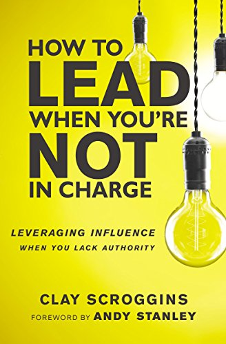

<section id="table-of-contents">
  <header>
    <h3>Overview</h3>
  </header>
  

  *  Auto generated table of contents
  {:toc}
  

</section>

## Yeah I'd like to lead, but I'm not in charge!
There's no technical topic today, a break midway through the [Website Performance Series](../website-performance-series-part-1/), but we'll be back to continue that after this post, promise. 

I recently mis-clicked on a related video on Youtube as I was getting my head around the mindfulness and focus technique called [Flow](https://www.youtube.com/watch?v=HmcNgOeKVCU&t=8s). This [video](https://youtu.be/PPtBqr8xA2I) was an interview of a Pastor by the name of Clay Scroggins, who wrote the book [How to lead when you're not in charge](https://www.harpercollins.com.au/9780310531579/how-to-lead-when-youre-not-in-charge-leveraging-influence-when-you-lack-authority/).

  <figure>
    
  </figure>

I have not read the book myself yet, however what I learned from the short time I was watching it, was that you don't need to have a title to affect your team/company. He discusses 4 main behaviors that are the pillars for this type of leadership, and how you can use your influence and get astonishing results:

1. **Lead yourself**,
2. **Choose positivity**,
3. **Think critically**, and lastly
4. **Resist passivity**.

### Self leadership
- have a plan, find out where I stand today, to determine where I am going. Much like when one sees a financial advisor, the first order of business is to find out where you are, before formulating where you want to go. Sometimes it is hard to find out where you are today, probably the easiest way is to ask family or a friend. Simply ask - `What is it like to be on the other side of me?`
  
- be intentional day to day, instead of sleepwalking through the day, be mindful that I have the responsibility of shaping my environment, the same one that is ultimately responsible for shaping me.

  <figure>
    
  </figure>
  
- Self leadership can be as simple as being choiceful with the crowd that I surround myself with. So my mother was right all along, you are who your friends are, she said.
  
- what books I am reading and movies I am watching. Generally always being mindful of the thoughts I allow into my mind.

### Choose Positivity
- It's all about mindset and positivity. I know that not all of us can be leaders in a company, in a department, in a team, however, for each one of us, it's our responsibility to bring energy, and positivity every single day.

  <figure>
    
  </figure>
  
- I have the ability to affect the climate in my team, I can affect change from within the team with my outlook and attitude. I have the power to influence the team from within. Conversely, I can adversely affect the mood of the team when I bring the worst attitude. This power of influence is real, and I have a choice.

### Think Critically
- Fundamental to critical thinking is ownership. When one considers things as your own, you tend to be more careful, more thoughtful about what's yours. You then start to think of ways to make things better, more efficient, in general to improve things all around. 

  <figure>
    
  </figure>
  
- Creating an oasis of excellence - so for the domain I am in charge of, I can use the influence I have to make it better, make my own little oasis of excellence, for whatever it is I am put in charge of.
  
- Critical thinkers are learners who notice things about themselves, and can connect problems and solutions together. 
  
### Reject Passivity
- Just because I don't have the authority right now, doesn't mean that I can just sit and let everything else happen around me. Bring my ideas, frustrations, excitement to the table for the team.
  
- Who knows, these frustrations that I bring forward may be what my team needs to spur them to move in the right direction. The excitement I exude can be what my team needs for that jolt of energy to push us in the path of improvement.

## Conclusion
- Today's post was a bit off the typical technical topic that I would normally publish, however I think that this was a good break from that monotony. Leadership topics are of interest to myself, after all, when you are a developer these days, you not only have to focus on the endless new technical skills that you have to learn and master. Soft skills, including today's topic on Leadership should be equally in your list of skills to continually improve on.
  
- Instead of the question being: `How can I lead when I am not in charge?`, I should change it to -  `How should I lead with the opportunity that I have?`.
  
- Everyday is an opportunity, and it's our choice. 

## Resources
- [Book - How to lead when you're not in charge - by Clay Scroggins](https://www.harpercollins.com.au/9780310531579/how-to-lead-when-youre-not-in-charge-leveraging-influence-when-you-lack-authority/)

  
