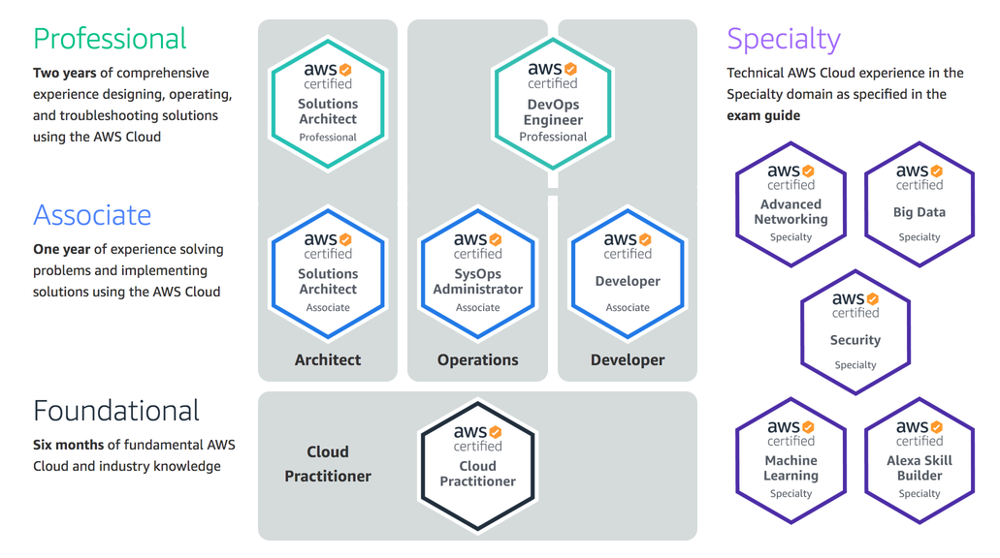
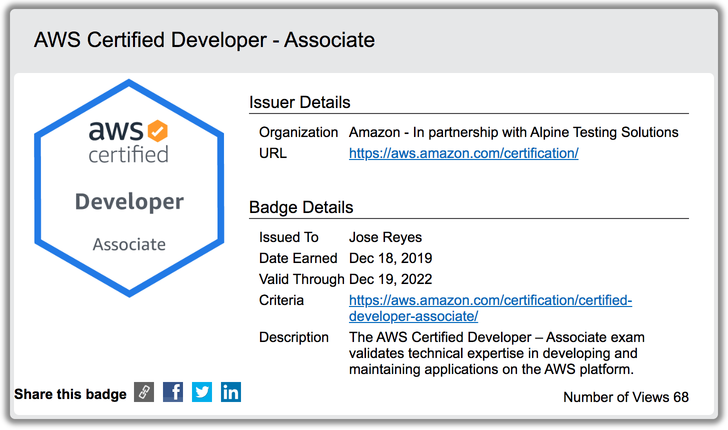

<section id="table-of-contents" class="toc">
  <header>
    <h3>Overview</h3>
  </header>
  

  *  Auto generated table of contents
  {:toc}
  

</section>

## Yeah, so I took the AWS Certified Developer - Associate Exam
It was the towards the end of November 2019 on a kayak outing when I decided to finally attempt to take this AWS certification after months of indecision. The year 2019 was rapidly coming to a close, things were kind of winding down at work, and I thought this was the best time to focus and have a good go at it. 

At that time, I was receptive to some kind of self improvement activity after mulling over and reflecting over my recent article - [How can I lead when I am not in charge? - an introspection](../how-to-lead-when-you-are-not-in-charge) - specifically the section `Lead yourself`. Being intentional in shaping the environment I belong to. I have decided that I want to belong to an environment of experts so I am exerting effort to be an expert myself. 

>be intentional day to day, instead of sleepwalking through the day, be mindful that I have the responsibility of shaping my environment, the same one that is ultimately responsible for shaping me

The year was coming to an end, I thought wouldn't it be cool if I could pull this off and collect an AWS certification, one of the top and in-demand industry certifications available in the market today. 

## Which certification do I take?

If I could only take one certification exam, which would it be?

Honestly, it didn't take long to decide on which Associate exam I was going to take. I knew of the AWS associate level exams however did not really know about the differences between a [Solution Architect - Associate](https://aws.amazon.com/certification/certified-solutions-architect-associate/), a [Developer - Associate](https://aws.amazon.com/certification/certified-developer-associate/), and a [SysOps Administrator - Associate](https://aws.amazon.com/certification/certified-sysops-admin-associate/) exam.

Being a developer, naturally I decided to take the Developer exam. Long after I took the test did I know their differences, and the AWS preferred order of taking them, which is the following:

- Take this 1st - Solutions Architect - Associate
- Then this 2nd - Developer - Associate
- Then this last - SysOps Administrator - Associate

And basing on public opinion, the difficulty level is in that order too, where SysOps Administrator is the hardest. Because I had already decided to take just one exam, I settled and set my mind on the Developer exam. 

<figure>
	<figcaption>AWS Certification Pathways</figcaption>
</figure>

## Is 2 weeks of study enough pass the exams?

My goal was to get certified before the 2019 holidays, so I promptly scheduled my exam on the 18th of December, just a couple of days before my break for Christmas.

How difficult could it be? At this stage I was already using AWS every day for close to a year, so I was fairly confident with my knowledge. However, having scanned the [AWS Developer - Associate exam guide](https://d1.awsstatic.com/training-and-certification/docs-dev-associate/AWS_Certified_Developer_Associate-Exam_Guide_EN_1.4.pdf), I quickly realized that I was not ready to take the exam as I had some gaps in knowledge.

My goal was to get certified, I knew most of the material, but I needed some help if I was to save time and be efficient in my study, as I had told myself that I can only afford 2 weeks of focus for it. 

Initially I had used Pluralsight, but I did not find it good enough, so I did some research and this is how I was able to get wind of [A Cloud Guru](https://acloud.guru/). So for the next 2 weeks, I devoured the ACG study course, where they have over 16 hours of video instruction, Hands on labs, comprehensive quizzes and exam simulator.

After 2 weeks of an average of **2 hours per day** study/review (and passing 2 of 3 goes with the exam simulator - 78%, then 71%, then 83%), I decided I was ready to get certified. 

## Day of the exams, my experience, my impressions
I had scheduled my exam in a test centre in nearby Parramatta at 9am, so I took the morning off work. Before you can start the test, the exam proctor performs the required ID checks (found out that 2 forms of ID are required - so I should have read the exam info beforehand), and no phone, no water, nothing in pockets are allowed, leave everything in a locker before going in the exam area. There is a A4 sized eraseable board for use as a scratch paper, but has to be strictly returned after the exam.

I had used all the allocated 140 minutes - for answering all the 65 questions, with 30 minutes to spare, which I used to review about 50% of the questions where I was not sure of the answers, when I had some sort of doubts.

I did find it moderately hard. Specially there are questions that there are more than 1 correct answers, but only one is the most correct answer. I did have a feeling that there was a chance that I might have just passed, or on the flip side, just flunked it.  

## Results

I allowed all of 140 minutes to expire, and after spending 5 minutes to give some AWS feedback on the testing experience, I was shown the result.

**I PASSED!!!** 

Not really high marks, however, at **827/1000**, I was happy with my effort - of achieving the AWS Certified Developer - Associate, before the end of 2019. All in all, I was happy with that result. 

<figure>
	<figcaption>Here is my Certification badge</figcaption>
</figure>

## Conclusion
I am not really a big fan of certifications. This is actually my first attempt of getting one. At this point, I don't think I will be getting another one in the near future. Contrary to my initial thoughts that getting a certification will prove that one is an expert, I think that is furthest from the truth.

It proves nothing else than just being familiar with the technology. It is similar when one learns to play the guitar. You can learn all the chords in the world. But that does not make you a good musician. For that you will need experience. 

What do you think?

## My Picks
These picks are things that have had a positive impact to me in recent weeks:

- [Fires Near Me](https://www.rfs.nsw.gov.au/fire-information/fires-near-me) - This has been my daily companion app since the Aussie bushfires started.
- [A Cloud Guru](https://acloud.guru/) - My main resource for cloud development training - AWS, Azure, GCP doesn't matter which one.
- [Terrace House - Tokyo 2019-2020](https://www.netflix.com/au/title/81077065) - Netflix original series, helping me improve my Japanese. 

## Resources
- [AWS Learning Paths](https://aws.amazon.com/training/learning-paths/)
- [The value of an AWS Certification](https://read.acloud.guru/the-value-of-an-aws-certification-b326779c9679)
- [AWS Cloud Certifications Explained: Which Certification Is Right for You?](https://blog.newrelic.com/engineering/aws-cloud-certifications-explained/)
  
