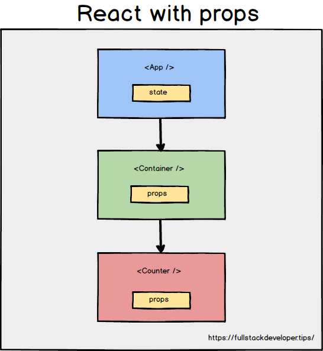
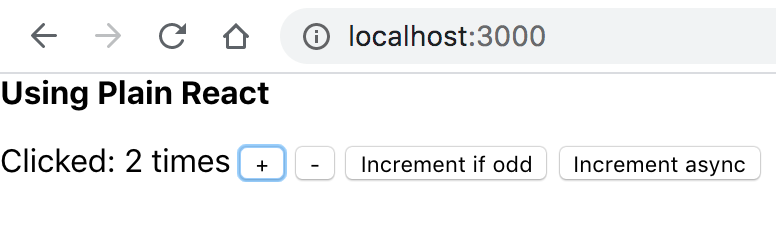
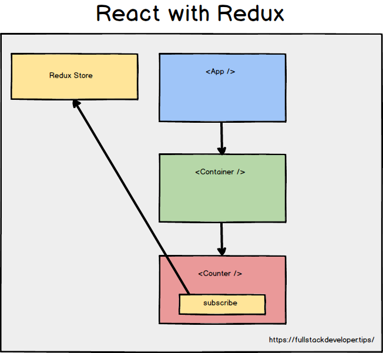
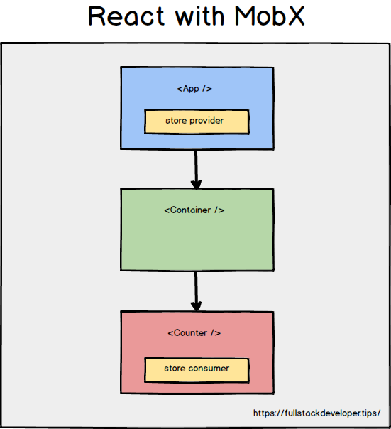
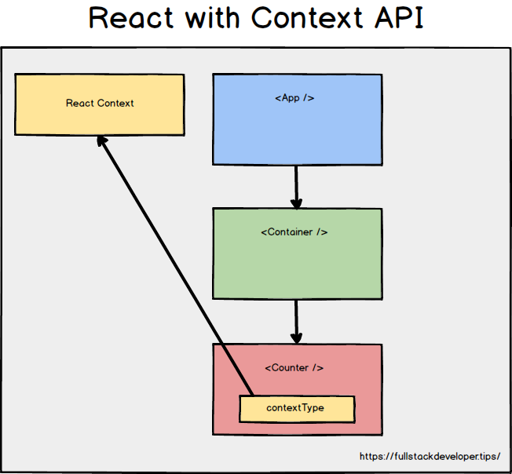

<section id="table-of-contents" class="toc">
  <header>
    <h3>Overview</h3>
  </header>
  

  *  Auto generated table of contents
  {:toc}
  

</section>

## Managing React application state

Prior to [React v16.8](https://reactjs.org/blog/2019/02/06/react-v16.8.0.html), there was only one way to manage your state and that was to create a React Class Component and change it with [setState()](https://reactjs.org/docs/state-and-lifecycle.html). Global application state was handled this way too. 

As your application grows in complexity, such as when your component heirarchy grows to multiple levels deep, application state management becomes increasingly cumbersome as you will need to pass props through all the component heirarchy, even if only the last component needs it.

This is what we call the [Prop Drilling Problem](https://kentcdodds.com/blog/prop-drilling), and we want to avoid this condition. Ideally, we only want to pass props to the components that need it. In fact we want to avoid having to pass props if we can help it.

<figure>
	<figcaption>React and Prop Drilling</figcaption>
</figure>

<!-- Around [mid February 2019](https://reactjs.org/blog/2019/02/06/react-v16.8.0.html), the much anticipated [React Hooks](https://reactjs.org/docs/hooks-overview.html) was released to allow developers to use local state with React Functional components. Yes, this now allowed what used to be called stateless functional components to have its own local state without having these passed down to it as props. -->

I have created a simple application that illustrates the prop drilling problem, see how props gets passed to all the components in the heirarchy, even if only Counter component needs it.



export default class App extends React.Component {
  constructor(props) {
    super(props);
    this.state = {
      count: 0
    };
  };

  // omitted for brevity
 
  render () {
    return(
      <Container appState={
        count: this.state.count,
        increment: this.increment,
        decrement: this.decrement,
        incrementIfOdd: this.incrementIfOdd,
        incrementAsync: this.incrementAsync,
      } />
    );
  };
};

function Container (props) {
  console.log(`Container: ${props.appState.count}`)
  return (
    <Counter appState={props.appState} />
  );
};

function Counter (props) {
    return (
      

        

          Clicked: {props.appState.count} times
          {' '}
          <button onClick={props.appState.increment}>
            +
          </button>
          {' '}
          <button onClick={props.appState.decrement}>
            -
          </button>
          {' '}
          <button onClick={props.appState.incrementIfOdd}>
            Increment if odd
          </button>
          {' '}
          <button  onClick={props.appState.incrementAsync}>
            Increment async
          </button>
        

      

    );
}



[Github link to the source](https://github.com/jaeyow/react-state-management)

<figure>
	<figcaption>React sample app</figcaption>
</figure>

## How Redux solves this

As an application becomes more complex, keeping application state in a top-level component, and passing props around everywhere may not be sufficient anymore. [Redux](https://github.com/reduxjs/redux) can help with this, and more. Here's more material around Redux [motivations](https://redux.js.org/introduction/motivation/) and what the motivations were when creating it. 

<figure>
	<figcaption>React and Redux</figcaption>
</figure>

I don't want to have to explain Redux as there are already lots of literature on this. What I would like to show is how Redux avoids the prop drilling problem by making the state available to any component that subscribes to it. 

I have created a Redux version of the same application to see how Redux does it. To make Redux easier to manage in a React application (Redux can be used outside React too), the [React bindings for Redux](https://react-redux.js.org/) can be used, however for this exaple we are using plain Redux. 



const store = createStore(counter);
const rootEl = document.getElementById('root');

const render = () => ReactDOM.render(
  <Counter
    value={store.getState()}
    onIncrement={() => store.dispatch({ type: 'INCREMENT' })}
    onDecrement={() => store.dispatch({ type: 'DECREMENT' })}
  />, rootEl);

render();
store.subscribe(render);



[Github link to the source](https://github.com/jaeyow/react-state-management)

## The MobX approach

Redux (and the React Redux bindings), is quite full featured and robust, however, it can be a pain to use with all the boilerplate code you have to setup, don't even get me started with using it with Typescript. When you are looking for an easier way, yet achieve somewhat the same results, you can try [MobX](https://github.com/mobxjs/mobx).

I have again ported our simple example here to use MobX. None of the immutability rules that you have to remember when writing Redux reducers, welcome to reactive heaven. MobX allows you to create a store and mark them as observables. You can then instantiate an object, and mark it as an observer. Whenever you change your observables, any observer will re-rendered, just like magic.

It's true, try it. 

<figure>
	<figcaption>React and MobX</figcaption>
</figure>



export default class App extends React.Component {
  render () {
    return (
      <Provider counterStore={new CounterStore()}>
        <Container/>
      </Provider>
    );
  }
}

const CounterContext = createContext(new CounterStore())

function useStore() {
  return React.useContext(CounterContext)
}

const Container = () => {
  return (
    <Counter />
  );
}

const Counter = observer(() => {
    const counterStore = useStore();
    return (
      

        

          Clicked: {counterStore.counter} times
          {' '}
          <button onClick={counterStore.increment}>
            +
          </button>
          {' '}
          <button onClick={counterStore.decrement}>
            -
          </button>
          {' '}
          <button onClick={counterStore.incrementIfOdd}>
            Increment if odd
          </button>
          {' '}
          <button  onClick={counterStore.incrementAsync}>
            Increment async
          </button>
        

      

    );
});



[Github link to the source](https://github.com/jaeyow/react-state-management)

## Maybe React Context Api is all you need

Before the new [Context API was released](https://reactjs.org/blog/2018/03/29/react-v-16-3.html), there wasn't really an official React way of passing state around to different React components. We had to resort to the typical prop drilling method explained above. Or npm install Redux or MobX and their thousand dependencies. If you are using React, then you may already have everything you need right there. 

<figure>
	<figcaption>React and Context API</figcaption>
</figure>



const AppContext = React.createContext();

export default class App extends React.Component {
  render() {
    return (
      <AppProvider>
          <Container />
      </AppProvider>
    );
  }
}

function Container() {
  const { counter } = useContext(AppContext); // consume context in functional component

  console.log(`Container: ${counter}`)
  return (
    <Counter />
  );
};

function AppProvider(props) {
  const [counter, setCount] = useState(0);

  var increment = () => {
    setCount(counter + 1);
  };

  var decrement = () => {
    setCount(counter - 1);
  }

  var incrementIfOdd = () => {
    if (counter % 2 !== 0) {
      increment();
    }
  }

  var incrementAsync = () => {
    setTimeout(increment, 1000);
  }

  const value = { counter, increment, decrement, incrementIfOdd, incrementAsync };
  
  return (
  <AppContext.Provider value={value}>
    { props.children }
  </AppContext.Provider>
  );
}

class Counter extends React.Component {

  static contextType = AppContext; // consume context in class based component
  render() {
    var value = this.context;
    return (
      

        

          Clicked: {value.counter} times
          {' '}
          <button onClick={value.increment}>
            +
          </button>
          {' '}
          <button onClick={value.decrement}>
            -
          </button>
          {' '}
          <button onClick={value.incrementIfOdd}>
            Increment if odd
          </button>
          {' '}
          <button  onClick={value.incrementAsync}>
            Increment async
          </button>
        

      

    );
  }



[Github link to the source](https://github.com/jaeyow/react-state-management)

## Conclusion
With all these options available to us, of course it makes it confusing to decide on which method to use. You will just have to try it out for yourself. Maybe start with the simple contrived examples that I have [created here](https://github.com/jaeyow/react-state-management). Like anything, you need hands-on experience to be able to pick one method from the other.

I used to pick Redux all the time. However, but once I saw how simple MobX makes things in comparison, I get that, and started using it more. 

But ever since the new Context API has been officially bestowed the stamp of approval from React, I will probably consider it before reaching in my tool belt for Redux and MobX.

## My Picks
These picks are things that have had a positive impact to me in recent weeks:

- [Data Science in 5 minutes](https://www.youtube.com/watch?v=X3paOmcrTjQ) - Data Science fascinates me, here's a handy guide.
- [Formula 1 2020](https://www.formula1.com/en/racing/2020.html) - I love Formula 1, however with the recent postponements due to the Coronavirus pandemic, it's curious how things will pan out this year.
- [Software Developer's Playlist](https://open.spotify.com/playlist/4tSM8QNzycuSyWqMLEUCb8) - If you need to be in the zone, this might help.  

## Resources
- [How to use React Context effectively](https://kentcdodds.com/blog/how-to-use-react-context-effectively/)
- [Application state management with React](https://kentcdodds.com/blog/application-state-management-with-react)
- [Why use React Redux?](https://react-redux.js.org/introduction/why-use-react-redux)
  
