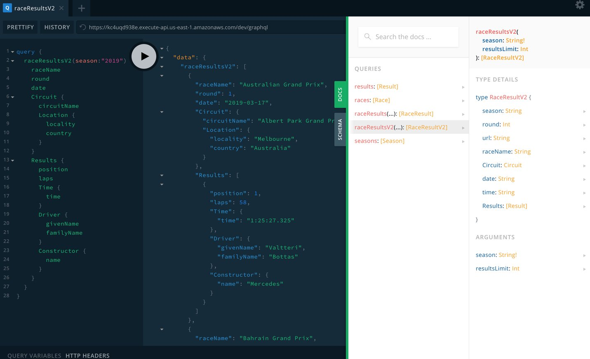
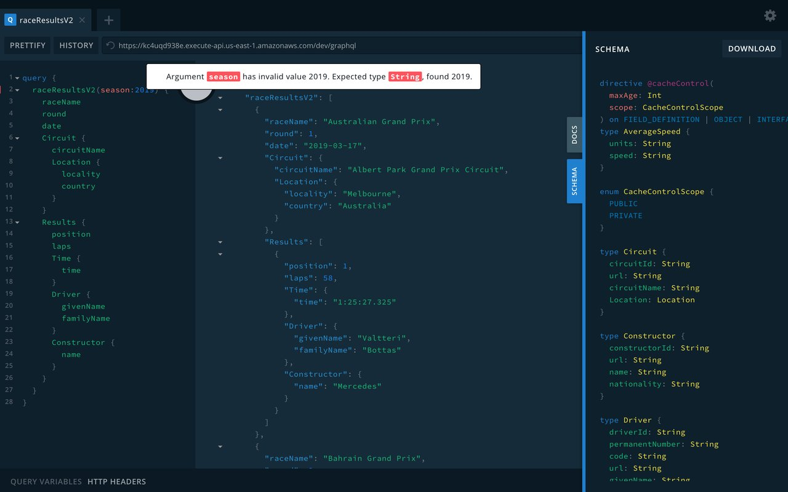
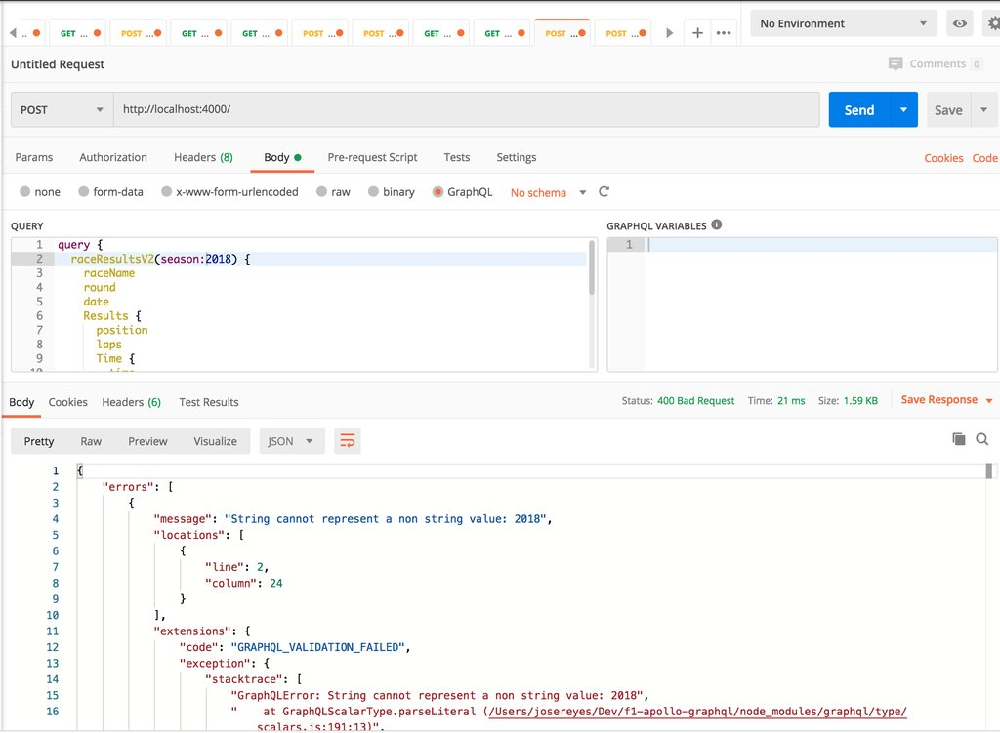
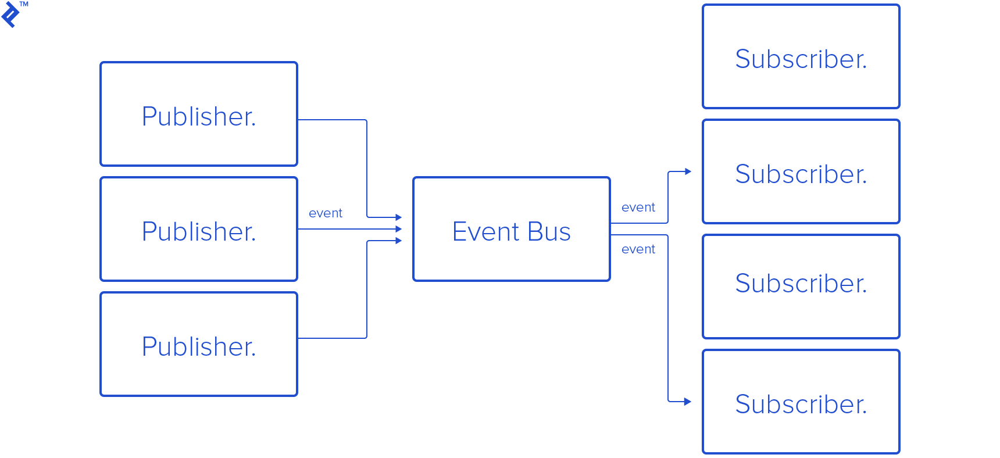

<section id="table-of-contents" class="toc">
  <header>
    <h3>Overview</h3>
  </header>
  

  *  Auto generated table of contents
  {:toc}
  

</section>

## Part of the [GraphQL Series](../tags/#graphql)

I recently picked up GraphQL as the next technology to learn in a bit more detail. In my next few posts, we will navigate our way through the GraphQL landscape. For our first post, we will look at the top 7 reasons why GraphQL is better than REST Api, and how our customers will love the apps that we create with it.  

## Reason 7: Rapid frontend development using the GraphQL playground

When I started learning GraphQL, I began playing with an existing api ([Star Wars API](https://graphql.org/swapi-graphql/)), and the first thing I encountered was the [GraphiQL](https://github.com/graphql/graphiql) tool. This is a built-in tool that GraphQL servers optionally ship with their API. Servers based on [Apollo](https://www.apollographql.com/docs/apollo-server/) currently use [GraphQL Playground](https://www.apollographql.com/docs/apollo-server/testing/graphql-playground/), a built-in tool built by [Prisma](https://www.prisma.io/) and based on GraphiQL. 

This tool allows you to ask the API what its capabilities are and enables you to send requests and get data back from the GraphQL server.

This is very compelling, as I was able to quite simply ask the server for data, I didn't have to go anywhere to read API documentation as it's all there, and I didn't have to use a separate application (like [Postman](https://www.postman.com/), although you can if you wanted to).

<figure>
	<figcaption>The GraphQL Playground shipped by Apollo Server (based on GraphiQL and built by Prisma)</figcaption>
</figure>

And when I finally moved to the frontend, it was a simple case of copying my GraphQL scripts from GraphiQL, and pasting it in Javascript. All the usual libraries that we used in REST API can be used with GraphQL, eg, [fetch](https://developer.mozilla.org/en-US/docs/Web/API/Fetch_API), [axios](https://github.com/axios/axios), [superagent](https://github.com/visionmedia/superagent), or simply just [XHR](https://javascript.info/xmlhttprequest), to name a few, so it is really quite easy to get productive on the frontend.

And if you want to leverage more advanced functionality, you can try [Apollo](https://www.apollographql.com/docs/) and its ecosystem of libraries and tools for both Server and Client use. 

## Reason 6: Built-in validation and type safety

Since GraphQL has type safety built into the system, it is simple to identify the validation requirements through the GraphQL playground. On the client, validation hints are supplied by the tool, and if you need some guidance, you can always bring up the API documentation anytime. 

<figure>
	<figcaption>GraphQL Playground has validation hints and api/schema documentation built-in</figcaption>
</figure>

However, if requests end up reaching the server, it can respond with rich validation error details that you can use on the client for user interface updates. 

<figure>
	<figcaption>Rich run-time validation errors returned by a GraphQL server</figcaption>
</figure>

## Reason 5: Only one API version to deal with

When GraphQL was announced in a [Facebook blog post](https://engineering.fb.com/core-data/graphql-a-data-query-language/) back in 2015, one of the features that was advertized is that it is `Version Free`. And it is still true till today, however, there is still a need to communicate appropriately between the frontend and backend teams in the case of removing functionality.

> The shape of the returned data is determined entirely by the client’s query, so servers become simpler and easy to generalize. When you’re adding new product features, additional fields can be added to the server, leaving existing clients unaffected. When you’re sunsetting older features, the corresponding server fields can be deprecated but continue to function. This gradual, backward-compatible process removes the need for an incrementing version number.  Lee Byron, Facebook

## Reason 4: Subscriptions are part of the GraphQL Standard

Typical web applications follow the usual request-response architecture, however, [GraphQL supports subscriptions](https://www.howtographql.com/graphql-js/7-subscriptions/) and libraries like Apollo or [Relay](https://relay.dev/docs/en/subscriptions) have their own implementations, based on [WebSockets](https://developer.mozilla.org/en-US/docs/Web/API/WebSockets_API), with its persistent network connections.

> Subscriptions are a GraphQL feature that allows a server to send data to its clients when a specific event happens. Subscriptions are usually implemented with WebSockets. In that setup, the server maintains a steady connection to its subscribed client. This also breaks the “Request-Response-Cycle” that were used for all previous interactions with the API.

<figure>
	<figcaption>A Publisher-Subscriber model (image copyright toptal.com)</figcaption>
</figure>

Event based communication like a publisher-subscriber model avoid the need for the clients to poll the server for new information. It allows for simpler code on the client, however, server code can be a bit more complex. Lucky for us, libraries from projects like Apollo and Relay, remove the need for us to create it from scratch. 

## Reason 3: API Documentation is built-in and auto-generating

I have already alluded to the self-documenting features of GraphQL when I talked about GraphQL Playground above. Each deployment has the capability to include it as part of the build, however, if you have elected not include this with your server, then schema information can be asked from the server through [GraphQL introspection](https://graphql.org/learn/introspection/). 

## Reason 2: Only one endpoint and a single request is all you need

A GraphQL server is typically served from a single endpoint, contrast to REST Api where multiple endpoints are utilized to represent separate resources. You simply advertize one endpoint to your clients, and with the built-in Api documentation, client development is a breeze. This single endpoint will deliver the full capabilities of the server including queries, mutations and subscriptions.

<figure>
	<figcaption>A GraphQL server can be used to aggregate several data sources</figcaption>
</figure>

And when you use GraphQL as a aggregator to multiple services/data sources, which can span database calls, wrapper to REST Api services to other GraphQL servers themselves, this single exposed endpoint can be your gateway to potentially vast functionality to your clients.

## Reason 1: You define the payload that you need

And finally the top reason on why GraphQL is better than REST, is that a client is able to request only the data that it needs, no more, no less. Compare this to REST Api, where you are limited by what the server had been programmed to return.With REST, you will either end up with more data than you actually need (over fetching), ending up having to massage and filter out the required data on the client. 

In REST scenarios, it is also common to see cases of under-fetching, where you end up having to send multiple requests to the server to get all the data you need on your client pages. 

When over-fetching, the optimizations afforded by GraphQL can translate to substantial savings in bandwidth on the clients, specially when these are on mobile devices as in the case of mobile browsers, or on mobile apps. When under-fetching, the time savings of multiple separate requests can be a substantial savings too, if not for the amount of data downloaded, but the latency of having to wait for all the multiple responses to arrive. 

## Conclusion

So there you have it, the top 7 reasons why GraphQL is better than REST. Although it looks as though I am saying there is no place for REST anymore, this further from the truth.

GraphQL is by no means a silver bullet. Because the GraphQL specification is still being worked on, for example, there is no detail for things like Authentication, or File uploads for example, where you will have to add your own implementation, they may not be the best technology to use in every case.

If we scan through the 7 top reasons above, you will find that there is a theme, all of them are mindful of our users (either the end-user of the client applications, or the client developers themselves), and give us a clear advantage over REST.

GraphQL allows us to transform our applications into better and more efficient applications that our customers will love, and our developers love to create.

## My Picks
These picks are things that have had a positive impact to me in recent weeks:

- [If AI Generated Feet are your thing...](https://thisfootdoesnotexist.com/) - This is a weird one, however I find it funny plus its using AI!
- [Traversy Media](https://www.traversymedia.com/) - Brad creates easy to understand and awesome free tutorial videos in Youtube. Its not all technical though. One of his best videos is the one where he talks about Impostor Syndrome.
- [Flatten the curve](https://www.washingtonpost.com/graphics/2020/world/corona-simulator/) - This will make it easy to imagine the effects that different scenarios will have on the curve.  

## Resources
- [Introducing GraphQL](https://engineering.fb.com/core-data/graphql-a-data-query-language/)
- [Apollo Server Documentation](https://www.apollographql.com/docs/apollo-server/)
- [Apollo Client Documentation](https://www.apollographql.com/docs/react/)
  