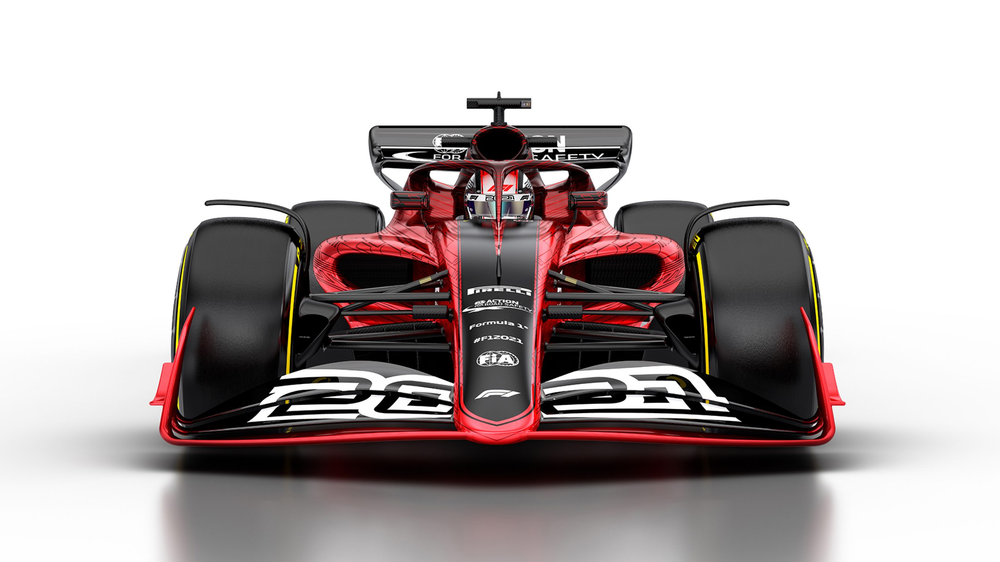

<section id="table-of-contents">
  <header>
    <h3>Overview</h3>
  </header>
  

  *  Auto generated table of contents
  {:toc}
  

</section>

## Part of the [GraphQL Series](../tags/#graphql)

We now continue our GraphQL journey as we try out [Apollo](https://www.apollographql.com/docs/apollo-server/) to implement our first GraphQL server. We'll use Apollo server - an open-source spec-compliant GraphQL server which is production-ready and is compatible with all GraphQL clients.

As with all posts here in [Fullstack Developer Tips](https://fullstackdeveloper.tips/), all source code is available open-source in [Github](https://github.com/jaeyow/f1-apollo-graphql), and for this post, we use [Github Actions](https://github.com/features/actions) for the first time to push it to production. I wanted to deploy this to the cloud, and my choice of cloud provider is AWS. To leverage free hosting, we will be deploying the GraphQL server to a Lambda using [Serverless](https://www.serverless.com/).

<figure>
	<figcaption>I Love Formula 1, pictured above is the new 2021 F1 car design.</figcaption>
</figure>

## What we are building

I love [Formula 1](https://www.formula1.com/), and for this GraphQL server, we will be exposing the Formula 1 results and standings since 1950 when the first race started. I don't have a database though, instead, we are sourcing our data from [Ergast Developer API](http://ergast.com/mrd/), and surfacing it with our GraphQL server.


// copy the following GraphQL query and use it with the server below
query {
  raceResults(season: "2019", resultsLimit: 3) {
    raceName 
    round
    date
    Circuit {
      circuitName
    }
    Results {
      position
      number
      points
      Driver {
        givenName
        familyName
      }
    }
  }
}


[Go on, try it live here!](https://kc4uqd938e.execute-api.us-east-1.amazonaws.com/dev/graphql)

## Step 1: Create your base NodeJS server

Because we are implementing this GraphQL Server using Apollo Server, a NodeJS based implementation, we are going to start the project using `npm init`. The following image shows this process, where when finished will generate an empty project with a package.json file. We're well on our way. 

<figure>
	<figcaption>Use npm init to create your project</figcaption>
</figure>

## Step 2: Add Apollo Server and other dependencies


npm i apollo-server graphql apollo-server-lambda nodemon axios promise dataloader


Following explains why we need the dependencies above:

[**apollo-server**](https://www.apollographql.com/docs/apollo-server/) - is the core library for Apollo Server itself, which helps you define the shape of your data and how to fetch it.

[**graphql**](https://graphql.org/) - is the library used to build a GraphQL schema and execute queries against it.

[**apollo-server-lambda**](https://www.apollographql.com/docs/apollo-server/deployment/lambda/) - while `apollo-server` is used for creating a GraphQL server that you can deploy in your own cloud instance, `apollo-server-lambda` is a drop-in replacement if you want to deploy your server in AWS Lambda. 

[**nodemon**](https://nodemon.io/) - watches for any changes and restarts your server when needed.

[**axios**](https://github.com/axios/axios) - our Http client of choice. 

[**promise**](https://developer.mozilla.org/en-US/docs/Web/JavaScript/Reference/Global_Objects/Promise) - library for helping us resolve our http requests.

[**dataloader**](https://github.com/graphql/dataloader) - is a port of a library originally developed in Facebook to help in batching and caching requests in the server.

<figure>
	<figcaption>Our base GraphQL server code, really.</figcaption>
</figure>

## Step 3: Add GraphQL schema definitions in typedefs.js

Now we need to work on some GraphQL specific tasks, starting with defining the schema. Schema is simply the shape of our data, both incoming and outgoing. This is what made me like working with GraphQL. Whether you are the server developer or on the other side of the fence as the client developer, it is a pleasure working with it. 


type Result {
    number: Int
    position: Int
    positionText: String
    points: Float
    Driver: Driver
    Constructor: Constructor
    grid: String
    laps: Int
    status: String
    Time: Time
    FastestLap: FastestLap
}


Have a look at the file [`typedefs.js`](https://github.com/jaeyow/f1-apollo-graphql/blob/master/typedefs.js) - this file contains all the schema that the server uses, in addition to that, GraphQL introspection will also use these for self-documenting the API. The excerpt with type `Result` above shows the GraphQL SDL (Schema Definition Language), the type system used to express our data types.

GraphQL servers support 3 operations - Query (reads), Mutations (writes), and Subscriptions (pub-sub system). In this sample server, we will only be using Queries, and leave the other types, possibly for another post.  

## Step 4: Add GraphQL resolvers in resolvers.js

APIs build up data and send back to the client, and it's no different with GraphQL. Our data sources may be varied - files, databases, web services, REST APIs, and other GraphQL servers themselves. A resolver collects and assembles the data and aggregates it before sending it back to the client. 

For example, our server below supports the following 4 queries, however lets focus on the one named ***raceResults***: 

type Query {
    results: [Result]
    races: [Race]
    raceResults(season: String!, resultsLimit: Int): [RaceResultV2]
    seasons: [Season]
}


And the following shows the simplicity of building a resolver that fetches data from an API: 

raceResults(parent, args) {
    const { season, resultsLimit } = args;
    return axios
        .get(`http://ergast.com/api/f1/${season}/results.json?limit=1000`)
        .then(res => {
            return res.data.MRData.RaceTable.Races.map((race) => {
                return({
                    ...race,
                    Results: race.Results.slice(0, resultsLimit || 1)
                });
            });
        })
        .catch(function (error) {
            console.log(`Error: ${error}`);
        });
}


## Step 5: Add Serverless configuration

[Serverless](https://www.serverless.com/) makes it super simple to deploy your serverless applications to the cloud. Because its cloud agnostic, it can handle whatever cloud framework you use.

For this project, we will be deploying to AWS Lambda, and take advantage of their [very generous free-tier](https://aws.amazon.com/free/?all-free-tier.sort-by=item.additionalFields.SortRank&all-free-tier.sort-order=asc), so we will never likely incur a bill. 

<figure>
	<figcaption>AWS Lambda deployment made easy with Serverless.</figcaption>
</figure>

Just setup your Serverless configuration in your project's root, and because it has a CLI, you can deploy from your command line, or from your CI/CD of choice, in this case [Github Actions](https://github.com/features/actions), coming up next. 

## Step 6: Add Github Actions workflow

<figure>
	<figcaption>GraphQL Server complete with CI/CD using Github Actions.</figcaption>
</figure>

Github recently released Github Actions and ever since then, I have heard so many great things about it. Because this project lives in Github, wouldn't it be awesome if the CI/CD lives there too? And its forever [**FREE for public repositories**](https://help.github.com/en/github/setting-up-and-managing-billing-and-payments-on-github/about-billing-for-github-actions), so how good is that?!

If you have a private repository, you will have to fork out some $, however you still get get 2,000 minutes (33.3 hours) build time per month before you start handing in the dough.

So here's our Github Actions deployment badge: 

## Profit!!!

There you go, our first GraphQL server built with Apollo Server, NodeJS, Serverless, AWS Lambda and Github Actions, built and deployed on AWS for FREE!

[Go on, try it live here!](https://kc4uqd938e.execute-api.us-east-1.amazonaws.com/dev/graphql)

[Source code forever open-source](https://github.com/jaeyow/f1-apollo-graphql)

In our next GraphQL installment we will:
- create a React client based on Apollo Client
- refactor our simple resolver to ditch the API call for DynamoDB NoSQL persistence

## My Picks
These picks are things that have had a positive impact to me in recent weeks:

- [The Path Less Pedaled](https://www.pathlesspedaled.com/) - I'm so into bike commuting, and looking into gravel bikes, this is the place to learn all about it. 
- [Netflix Series: Drive to Survive](https://www.netflix.com/au/title/80204890) - This series is responsible for getting me hooked into Formula 1. This race has a lot to be digested, but once you understand the basics, your are fan forever.  

## Resources
- [Github Actions @ Visual Studio Toolbox with Aaron Powell](https://www.youtube.com/watch?v=0tMkRSdp-Go)
- [Apollo Server Documentation](https://www.apollographql.com/docs/apollo-server/)
- [Deploying to AWS using Serverless](https://www.serverless.com/framework/docs/providers/aws/guide/deploying/)
  
  