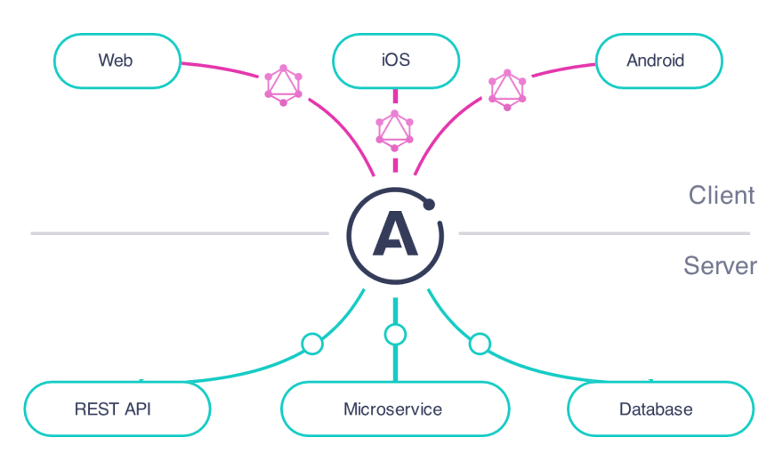
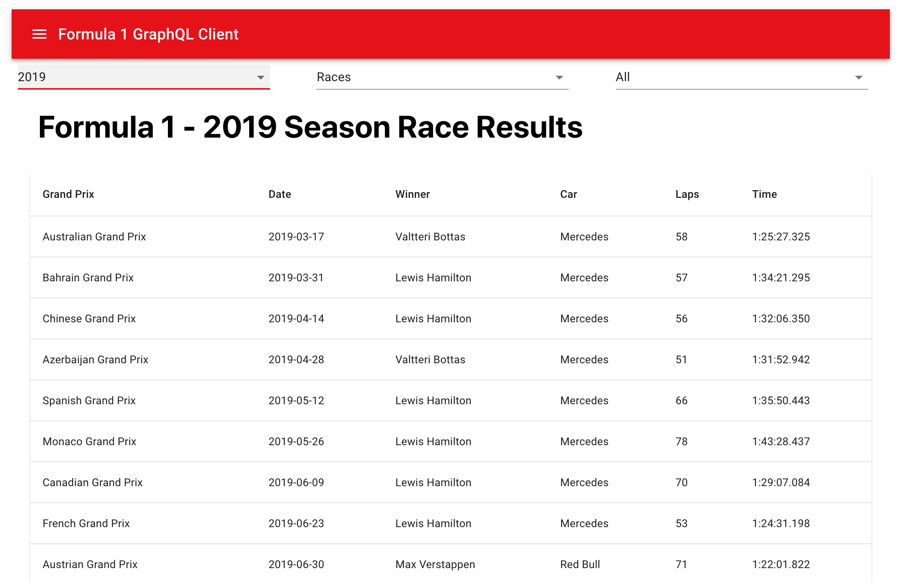
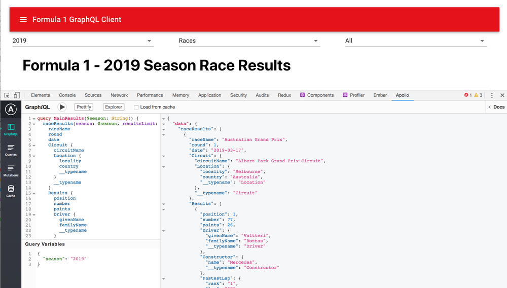

<section id="table-of-contents" class="toc">
  <header>
    <h3>Overview</h3>
  </header>
  

  *  Auto generated table of contents
  {:toc}
  

</section>

## Part of the [GraphQL Series](../tags/#graphql)

In my previous [GraphQL blog post](https://fullstackdeveloper.tips/6-steps-to-your-first-graphql-server/), I promised to follow it up with an article about what an [Apollo GraphQL client](https://www.apollographql.com/client/) might look like.

In this post we do just that, still about Formula 1, (as an aside yesterday found out that [Daniel Ricciardo will be moving to McLaren](https://www.abc.net.au/news/2020-05-14/daniel-ricciardo-leaves-renault-to-join-mclaren-formula-one/12249854) to replace Sainz who will be replacing Vettel at Ferrari).

<figure>
	<figcaption>Apollo Client to create modern web applications</figcaption>
</figure>

Apollo Client is the perfect pairing for the [F1 GraphQL Server we built](https://kc4uqd938e.execute-api.us-east-1.amazonaws.com/dev/graphql) in the last blog post. But before we start, we have to know a little bit more about it. And as I will explain further, there may be more to it than what its name might suggest. 

## What we built

In this article we will be inspecting an Apollo GraphQL Client that I built specially for the server we created for the last article. I am calling it [F1 GraphQL Client](https://f1-graphql-client.s3.amazonaws.com/index.html), a reference ReactJS GraphQL consumer. Nothing fancy, rough around the edges, but it serves the purpose of showcasing how easy it is to get it up and running. 

<figure>
	<figcaption>I Love Formula 1, pictured above is the new 2021 F1 car design.</figcaption>
</figure>

All source code is available at [FullstackDeveloper.Tips Github](https://github.com/jaeyow/f1-graphql) and forever free however you want to use it. It is also [hosted at AWS S3](https://f1-graphql-client.s3.amazonaws.com/index.html), so go ahead play with it to your heart's content. As usual, I have used Github Actions to automatically deploy it to S3 once it is pushed to the repo. 

<figure>
	<figcaption>We are building a simple GraphQL consumer using Apollo Client</figcaption>
</figure>

## What is Apollo Client?

> Apollo Client is a complete state management library for JavaScript apps. Simply write a GraphQL query, and Apollo Client will take care of requesting and caching your data, as well as updating your UI. - Apollo Client docs

What?!? Apollo Client is a **state management library**? That I did not expect. This is the very first statement that you will read in the official online Apollo Client [documentation](https://www.apollographql.com/docs/react/). I wasn't really convinced at first, I thought, with ReactJS and all other supporting libraries, why would I need yet another one?

Please read on and find out. 

### Declarative configuration
Because GraphQL is still using HTTP, any of the usual libraries that we use in REST API can be used with GraphQL, eg, [fetch](https://developer.mozilla.org/en-US/docs/Web/API/Fetch_API), [axios](https://github.com/axios/axios), [superagent](https://github.com/visionmedia/superagent), or simply just [XHR](https://javascript.info/xmlhttprequest). We can use them, however, forget about them for the moment. Let's try the Apollo Client and prepare to be blown away.

Using Apollo client and and the library's **useQuery** hook, you can create your GraphQL requests declaratively, and not have to create data access code with your favorite library.


export default function QualifyingResultsTable() {
  const classes = useStyles();
  const { filters } = useContext(AppState);
  const { loading, error, data } = useQuery(QUAL_RESULTS, {
    variables: { season: filters.season }
  });
  if (loading) return (
    <Grid item xs={4} className={classes.root}>
      <CircularProgress size={20} className={classes.spinner} ></CircularProgress>
    </Grid>
  );
  if (error) return 
Error :(
;
  const quals = data.qualifying[filters.detail] ? data.qualifying[filters.detail].QualifyingResults : null;  

  return (
    <TableContainer component={Paper}>
      <Table className={classes.table} aria-label="simple table">
        {/*... removed for brevity ...*/}
        <TableBody>
          {
            quals &&
            quals.map((result, row_i) => {                        
            return (
              <TableRow key={row_i}>
                <TableCell align="left" component="th" scope="row">{result.position}</TableCell>
                <TableCell align="left">{result.number}</TableCell>
                <TableCell align="left">{result.Driver.givenName}</TableCell>
                <TableCell align="left">{result.Constructor.name}</TableCell>
                <TableCell align="left">{result.Q1}</TableCell>
                <TableCell align="left">{result.Q2}</TableCell>
                <TableCell align="left">{result.Q3}</TableCell>
              </TableRow>
            );
            })
          }
        </TableBody>
      </Table>
    </TableContainer>
  );
}


On line number 4, you get **loading** and **error** flags built-in to indicate those states, and **data** containing the requested data. In the example on line 22, you can see the view directly using it. Isn't that awesome?

### Client-side caching for free
Without any configuration, all your requests are cached on the browser. So if you use the same query in other parts of your SPA, you will get instant response from your local Apollo Client cache. If there are advanced cases that is not handled by the default behavior, you can [customize them](https://www.apollographql.com/docs/react/caching/cache-configuration/), but this is out of scope for this article.

Try the [caching functionality](https://f1-graphql-client.s3.amazonaws.com/index.html) now. The first time you load 2019 data, there is a bit of a delay as the request completes. But you go away to another season, say 2018, and come back to 2019, it will be instant as that data is already in the Apollo Client cache. 

### Throw away Redux and MobX, state management is built-in
In the code snippet above, where we have **error** and **loading** and **data**, if we were not using Apollo Client, we would handle these manually by creating reducers in Redux or stores in MobX. But because client side caching is built-in, we can leverage this and use it as our app state management. Here's more information about this from the [source](https://www.apollographql.com/docs/react/data/local-state/).

### Handy developer tools
Development productivity is important to ensure adoption. One cool feature is a Chrome DevTools extension that allows you (in your local dev environment) easily interact with your GraphQL client and server, including your local Apollo Client cache. 
<figure>
	<figcaption>When working locally Apollo Client Developer Tools is really handy</figcaption>
</figure>

### Easy integration with your favorite JS framework
I have shown the integration in ReactJS above, however, many other platforms are supported too like [Angular](https://angular.io/), [Vue](https://vuejs.org/), [Meteor](https://www.meteor.com/), and [Ember](https://emberjs.com/), to name a few. 

## Conclusion
Today's article is a concise introduction to Apollo Client, and and the sample application demonstrates that creating a GraphQL client is simple specially if you use Apollo Client. With it's declarative style, caching, developer tools and easy integration with your project, you can get started and be productive in no time.

Please try [F1 GraphQL Client live](https://f1-graphql-client.s3.amazonaws.com/index.html) here! [Source code for F1 GraphQL Client](https://github.com/jaeyow/f1-graphql) is available here.

## My Picks
These picks are things that have had a positive impact to me in recent weeks:

- [AWS ReInvent 2019 Amazon DynamoDB Deep Dive](https://www.youtube.com/watch?v=6yqfmXiZTlM&t=2951s) - Hands down the best material out there on DynamoDB. Lots of Aha moments in this one. When I started learning DynamoDB I find myself watching this over and over again.
- [International Cycling (and Running) without leaving your house](https://zwift.com/) - In this age of months long lockdowns, I have never really left cycling thanks to [Zwift](https://zwift.com/).   

## Resources
- [Apollo Client](https://www.apollographql.com/docs/react/)
- [Apollo Server Documentation](https://www.apollographql.com/docs/apollo-server/)
- [F1 Ergast API](http://ergast.com/mrd/)
  
  