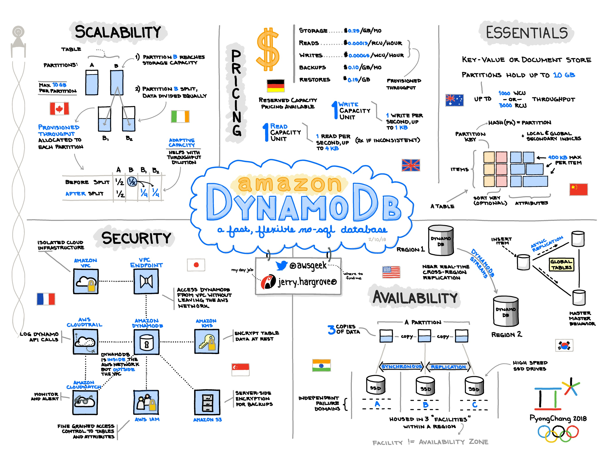

<section id="table-of-contents" class="toc">
  <header>
    <h3>Overview</h3>
  </header>
  

  *  Auto generated table of contents
  {:toc}
  

</section>

## Part of the [DynamoDB Series](../tags/#dynamodb)

I love being involved in application development as a full stack developer. I get to experience a wide variety of technologies all the time. Sometimes you get the odd legacy application using old and ancient technology (one time I worked on a full jQuery application for a week!), but at other times something more recent and cool.

One such project was to provide some functionality updates to an existing web application developed a couple of years back. It was a modern DynamoDB-based application using ReactJS for the front-end. I belong to a small team, so with small projects like that, we typically choose a general section to work on. One developer picks the front-end, while another works on the back-end, that sort of thing.

*DynamoDB is a proprietary DB offering from AWS*

In this particular instance, I declared dibs on the database/backend changes. Prior to that, I had never really commercially worked on a real NoSQL project before. A few years back, I dabbled in a couple of tutorials with MongoDB but that was it. I was already confident with development using SQL at that stage, so how could DynamoDB be any different?

_**Boy was I wrong!**_

In the end, I was able to complete the modifications to my satisfaction, however it took an enormous amount of time and effort to forget about what I already knew about relational databases, and rewire my brain to think the DynamoDB way.

The following are the misconceptions about DynamoDB that myself and many other beginners or those not using it will probably have. As I got more confident with the technology in the course of this project, I found that these misconceptions were all unfounded.

Read on to find out why.

## 5 common misconceptions about DynamoDB

### 1) DynamoDB can only do simple key-value stores

I know that this is a very common misconception. Specially for me because up to this point I have never really seen an example of DynamoDB being used for a more complicated application. Even for the project I was working on, it was just a step above a simple key value store.

Now that I have looked at DynamoDB in a bit more detail, in the course of studying for an AWS certification - [AWS Certified Data Analytics - Specialty](https://aws.amazon.com/certification/certified-data-analytics-specialty/), I knew that there is more to DynamoDB than just a key-value store. Part of the coursework is all about DynamoDB, this actually the main reason why I declared dibs on it.

On researching about the topic, I stumbled upon the book called [The DynamoDB Book - by Alex DeBrie](https://www.dynamodbbook.com/). There is also this [AWS re:Invent 2019 video by Rick Houlihan](https://www.youtube.com/watch?v=6yqfmXiZTlM&t=1845s), an AWS NoSQL Blackbelt. Both of these guys opened my eyes to what DynamoDB can do.

**One to one relationships. One to many relationships. Many to many relationships. Single digit latency regardless of the database size.** What?!! I didn't know it can do that! Whatever SQL can do, DynamoDB can too, and more. However, the key to unlock these was to unlearn most of the things you know about relational databases.

I became a DynamoDB convert then and there.

### 2) DynamoDB is only for low volume applications and cannot scale

Not sure where this misconception came from. I guess from my very limited exposure to the technology, naturally I really did not know its strengths and weaknesses. But this is really unfounded. Amazon.com, yes the retail giant, requires all Tier 1 workloads and services require to use DynamoDB.

Tier 1 services are those that will lose the company money if the system had a downtime. You can imagine that Amazon.com's online ordering system is not really a low-volume and simple application. I rest my case.

### 3) DynamoDB is only for large complex applications that scales infinitely

This is a funny one as it is opposite the previous point, that DynamoDB can only be used for large and complex applications and that you should not waste time in learning it for simple applications and low volume workloads. The truth is, if DynamoDB can handle large and complex application workloads like Amazon.com's, then anything less will be child's play.

It is true though, be it for small and low workloads to large, complex and heavy applications, it will keep it's single digit millisecond performance. Whether you're a startup or a giant and you get a large uptick on your workload , you will be thankful you have chosen DynamoDB when you first started.

### 4) I’m an expert in relational databases so using DynamoDB is a piece of cake

Personally, this is how I felt before I started working on the application. Not that I was an expert in SQL, but I was already had the confidence in tackling any SQL related task. As the technology has matured, almost every developer will be expected to have SQL proficiency in his toolbox.

<figure>
	<figcaption>DynamoDB - a fast, friendly NoSQL database (copyright Jerry Hargrove)</figcaption>
</figure>

> Here's a list of DynamoDB truths - There are no JOINS in DynamoDB...Before touching any DynamoDB table, you should know your access patterns up-front... Be careful in picking the primary key as you might end up having hot partitions and will drastically affect performance... Avoid using  Local Secondary Index... The advantages of Secondary Global Index and they are better... Don't use SCAN or if you have to use it know the drawbacks... Be careful in filtering your data or else you're just wasting your money... Once you have picked your table/index strategy, it's the end of the world, as you are stuck and cannot change this anymore - is a false statement... Yes you can use multiple tables and just allow the application to aggregate the data, however this is not optimal and AWS' recommendation is to use Single-Table design... The list goes on and on...

To learn to use DynamoDB correctly you have to unlearn things that you know about relational databases, and entails a very steep learning curve.

No, DynamoDB is not easy, but boy is it powerful.

### 5) You don't need a schema when you are using DynamoDB

It is true that NoSQL databases, DynamoDB included, are not restricted by a schema like relational databases such as SQL. But that doesn't mean that you should not use one.

All this means is that DynamoDB does not use a schema at the database level. However when you are working with it in your application, you would need to organize your item collections and data structures into some sort of system, otherwise it would be very difficult to reason about and read back the data from the database.

## Conclusion

Today we covered the top 5 common misconceptions about NoSQL and DynamoDB in particular that have been circulating through the years. But misconceptions are just false statements spread by inaccurate information either intentionally or not. Dispelling these false information is quite simple, just start learning!

The two references I have listed in the Resources below taught me everything I needed to know about DynamoDB. However I did my part too. Putting a bit of effort in getting to know DynamoDB a little bit better resulted me not only debunking these misconceptions, but enabled me to use DynamoDB as AWS intended.

In the next articles about DynamoDB, we will explore:

- The approach I use to effectively design my DynamoDB tables
  
- Use DynamoDB how Amazon intended through an example project and walkthrough
  
- Migrating an existing DynamoDB project when you need to add access patterns unknown when first developed

## My Picks

These picks are things that have had a positive impact to me in recent weeks:

- [Learn to Juggle!](https://www.youtube.com/watch?v=dCYDZDlcO6g) - Been indoors a lot due to the COVID-19 lockdown, so I have been practicing my juggling more these days. Here's one of my YouTube "instructors".
- [How to Win Friends and Influence People](https://www.booktopia.com.au/how-to-win-friends-and-influence-people-dale-carnegie/book/9781460752661.html/) - This is an oldie but goodie, and will never go out of style.
- [NoSQL Workbench for Amazon DynamoDB](https://docs.aws.amazon.com/amazondynamodb/latest/developerguide/workbench.html) - An indispensable resource to help you model and visualize your DynamoDB tables.

## Resources
- [AWS re:Invent 2019 - Amazon DynamoDB deep dive: Advance Design Patterns](https://www.youtube.com/watch?v=6yqfmXiZTlM)
- [The DynamoDB Book](https://www.dynamodbbook.com/)