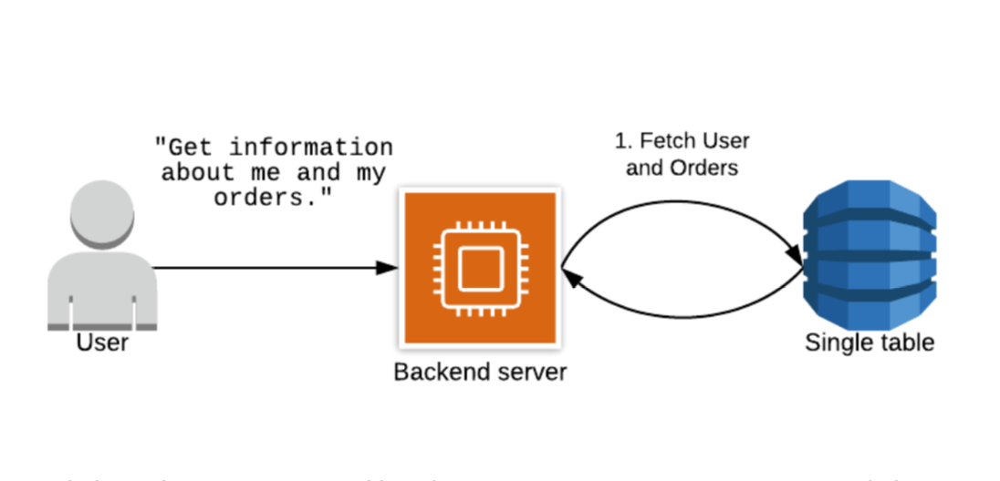
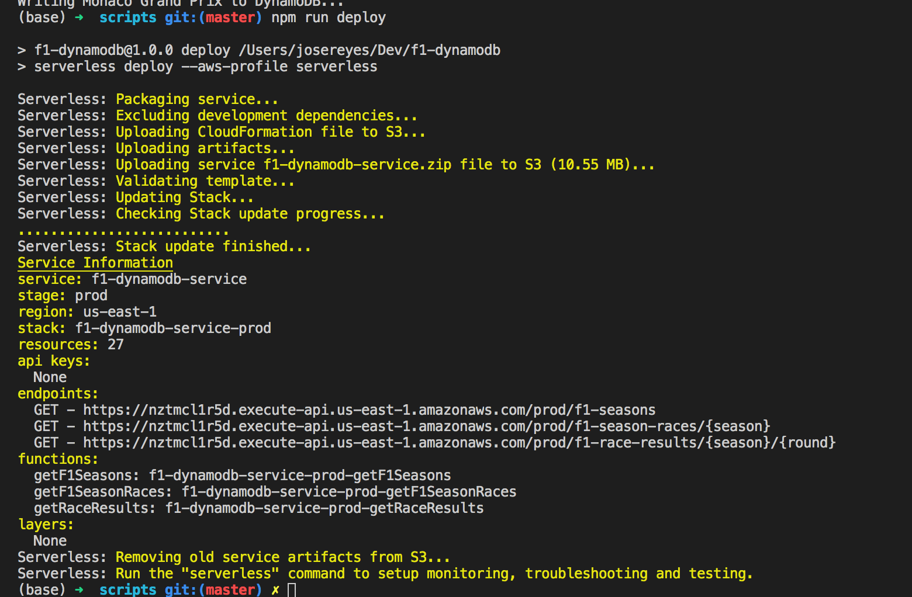
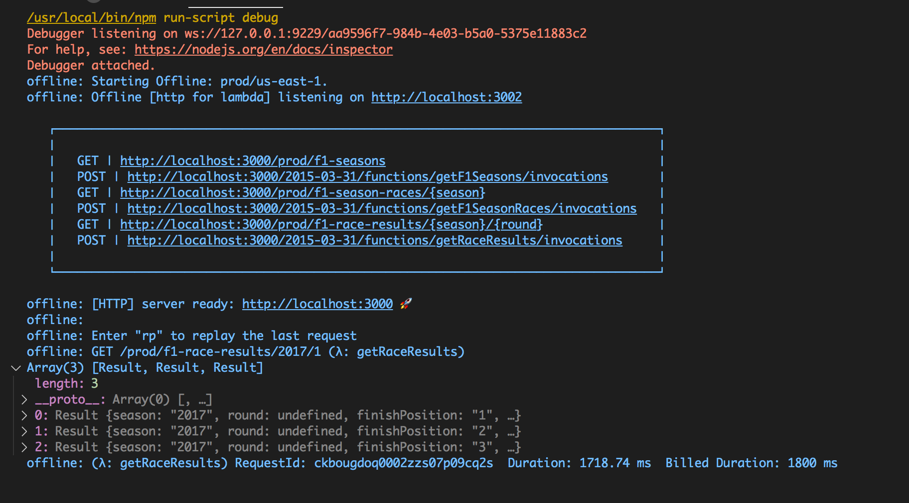
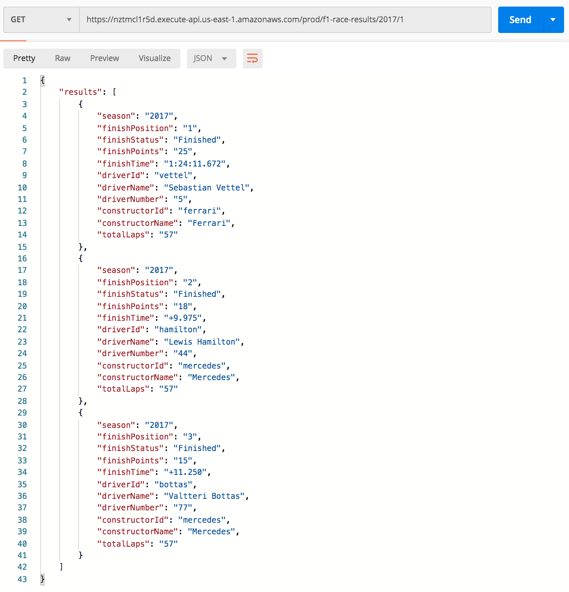

<section id="table-of-contents">
  <header>
    <h3>Overview</h3>
  </header>
  

  *  Auto generated table of contents
  {:toc}
  

</section>

## Part of the [DynamoDB Series](../tags/#dynamodb)

Before I first started working with DynamoDB, I thought that working with NoSQL databases like DynamoDB is easy, similar to any relational database I'm used to. I realized that DynamoDB is different, and there is a steep learning curve involved.

To reap all the benefits of DynamoDB, you have to use it [how Amazon intended](https://docs.aws.amazon.com/amazondynamodb/latest/developerguide/bp-general-nosql-design.html){:target="_blank"} - using as few tables as possible, ideally a single table per application, instead of the usual one-table-per-entity method that we have been doing with RDBMS all these time.

> As a general rule, you should maintain as few tables as possible in a DynamoDB application. - AWS DynamoDB Developer Guide

Follow along as I implement the Single-Table method from scratch, find out the framework and tools I used to make the process easier, and finally the **light-bulb moment** when it all made sense!

## How NOT to use DynamoDB

Many developers familiar with databases will approach DynamoDB in a similar way to developing with relational databases - i.e., normalize all data, keep each entity in it's own table, and join table data at the point of query. This is well and good for relational databases, however we cannot continue this way with DynamoDB because it does not have joins like what SQL has.

The process of joining tables is an expensive operation. It takes a lot more CPU cycles to gather related data from separate tables, than if all the related data can be retrieved with a single request. This is the approach that NoSQL databases have adopted, instead of trying to make joins faster, it avoids the problem completely by dropping support for it.

*Figure 1: Multiple-Table Design in DynamoDB will result in unnecessary multiple network requests (Copyright, The DynamoDB Book)*

Even with this limitation, it hasn't stopped many developers from persevering with multiple table design, and end up joining the data at the application itself - without realizing the implication of that decision. This will result to higher costs since the application will need to make multiple network requests to the database. It will still work, but with more requests to the database than needed. Moreover, as the application scales, it keeps getting slower and slower, and more expensive to run.

In the end, they will hate DynamoDB because it is **SLOW** and **EXPENSIVE**, disgruntled that DynamoDB did not keep its promise of single digit millisecond latency.

If only they invested the time to learn how to use this technology correctly, I'm sure the end result would have been totally different.

## The recommended way to use DynamoDB

Amazon intended developers to use as few tables as possible, ideally one table per application. In Computer Science, study on cache operations will mention [locality of reference](https://www.geeksforgeeks.org/locality-of-reference-and-cache-operation-in-cache-memory/){:target="_blank"} - this is defined the single most important factor in speeding up response time.

This also translates well to NoSQL databases - so keeping related data together has a major impact to cost and performance. Instead of spreading your entities across multiple tables, you should strive to keep it in one table to enable you to get all those related data with a single request.

> Instead of reshaping data when a query is processed (as an RDBMS system does), a NoSQL database organizes data so that its shape in the database corresponds with what will be queried. This is a key factor in increasing speed and scalability. - AWS DynamoDB Developer Guide

This is the promise of single table design - avoiding the costly join operation and take advantage of the cost and speed efficiency of getting all heterogenous related items with that single request.

*Figure 2: Single-Table Design in DynamoDB will result in more efficient requests (Copyright, The DynamoDB Book)*

Only after having read articles by [AWS Data Hero Alex DeBrie](https://aws.amazon.com/blogs/aws/meet-the-newest-aws-heroes-including-the-first-data-heroes/){:target="_blank"} and watching a [video by AWS NoSQL Blackbelt Team Lead Rick Houlihan](https://www.youtube.com/watch?v=6yqfmXiZTlM&t=1845s){:target="_blank"} did it occur to me that there is more to DynamoDB than I initially thought. That to make sure that DynamoDB scales, remains performant and cost effective, one must listen and learn from the knowledge of the experts.

## Tools/Libraries used

So in this article, we will walk through a simple project and approach it how you would when starting a typical DynamoDB-based application.

The following tools and libraries were used:

- [NoSQL Workbench](https://docs.aws.amazon.com/amazondynamodb/latest/developerguide/workbench.html){:target="_blank"} - AWS recently released (GA on 2 March 2020) an application for learning and working with DynamoDB. This tool helps you create your entities and was responsible for that light bulb moment when I visualized my models and item collections with its [Aggregate View](https://docs.aws.amazon.com/amazondynamodb/latest/developerguide/workbench.Visualizer.AggregateView.html){:target="_blank"} feature.

- [AWS-SDK](https://aws.amazon.com/sdk-for-node-js/){:target="_blank"} - Node.js version of the AWS SDK that allows access to DynamoDB features among other things.

- [AWS Lambda](https://aws.amazon.com/lambda/){:target="_blank"} - AWS Lambda is Amazon's serverless offering, which is a simple way to host serverless functionality using Amazon's tried and tested infrastructure.

- [Serverless](https://www.serverless.com/){:target="_blank"} - easily handle the deployment our Lambda using this popular infrastructure-as-code product.

- [NodeJS](https://nodejs.org/en/){:target="_blank"} - it's all Javascript for this project, no front-end (we'll tackle that in a separate article), so we've picked NodeJS for its simplicity.

## The Single-Table method

### 1) Application definition

The application is called **F1 DynamoDB** a NodeJS API which returns Formula 1 racing related data and results. It is a subset of a project that I would like to eventually complete. If only I don't get distracted by the many interesting bits in technology! It is also fitting to host it in AWS Lambda, DynamoDB is best used for serverless applications after all.

### 2) Creating an Entity Relationship Diagram

Did you think that we have left Entity Relationship Diagram in the realm of RDBMS? No! ERDs are still quite useful when dealing with NoSQL databases, as we are still trying to show the relationship between entities, even when these are all co-located in the single table.

*Figure 3: Entity Relationship Diagram for F1 DynamoDB project*

### 3) Define the access patterns up front

One of the main differences with developing with DynamoDB is you have to know your access patterns up front. This was hard for me to get my head around as I started tinkering with DynamoDB. Normally, we don't give much thought about this with SQL, which steers us towards a general-purpose database, at the expense of scalability.

DynamoDB will not allow you to create slow queries, defining the query patterns up-front is the compromise. Ensuring you create a scalable database, at the expense of general purpose utility.

For our simple app, we want to support the following:

- *Get all Formula 1 seasons*
  
- *Get all races for a given season*
  
- *Get all race results for a given race*

### 4) Creating the entity map

With single-table design, because we are storing multiple entity types in the same table, we typically overload the primary key and sort keys. We normally use generic names for these keys like **PK** and **SK**.

| **Entity**   | **PK**              | **SK**                               |
|:-------------|:--------------------|:-------------------------------------|
| **Season**   | SEASON#\<*season*\> | SEASON#\<*season*\>                  |
| **Race**     | SEASON#\<*season*\> | RACE#\<*round*\>                     |
| **Result**   | SEASON#\<*season*\> | RACE#\<*round*\>#RESULT#\<*rank*\>   |

Unlike in multiple-table design where you can be more descriptive of your primary key and sort key names to reflect more closely what items the table contains.

And here is a screenshot of NoSQL Workbench visualizing in Red the **Season** item collection, containing both **RaceItem**(Green) and **ResultItem**(Blue) data. These related race data can be requested in a single request, simulating the join-like behavior in RDBMS, and this is when the penny dropped for me!

<figure>
	<figcaption>Figure 4: NoSQL Workbench screenshot of the Season Item collection</figcaption>
</figure>

### 5) NodeJS development framework

OK, now this is when we start looking at some real code! First of all, I have [F1 DynamoDB in Github](https://github.com/jaeyow/f1-dynamodb){:target="_blank"}, so if you want to, clone this repo and do anything that you want with it! Source code has been adapted from [The DynamoDB Book](https://www.dynamodbbook.com/){:target="_blank"}, props to Alex for creating an excellent DynamoDB resource.

- Step 1 - Defining the serverless setup

The very first thing is to add Serverless setup in [serverless.yml](https://github.com/jaeyow/f1-dynamodb/blob/master/serverless.yml){:target="_blank"} file. I am a proponent of infrastructure-as-code and Serverless enables us to do this easily.

Our Serverless configuration does the following noteworthy items:

  1. creates/updates the DynamoDB resources, including specifying **On-Demand** provisioning
  1. creates/updates the AWS Lambda containing the API
  1. enables running the Lambda for local development

*Figure 5: Output of the Serverless DynamoDB deployment*

And in the file [package.json](https://github.com/jaeyow/f1-dynamodb/blob/master/package.json){:target="_blank"}, the **deploy** script will deploy to AWS from VSCode, while **debug** will run the API locally for development and debugging purposes.

*Figure 6: Output of the Serverless offline for local development*

- Step 2 - Defining your entities

Based on our [ERD we have 3 entities](#2-creating-the-entity-relationship-diagram){:target="_blank"} - seasons, races, and results. This corresponds to our 3 entities in our application. [Seasons](https://github.com/jaeyow/f1-dynamodb/blob/master/entities/f1Seasons.js){:target="_blank"}, [Races](https://github.com/jaeyow/f1-dynamodb/blob/master/entities/races.js){:target="_blank"} and [Results](https://github.com/jaeyow/f1-dynamodb/blob/master/entities/results.js){:target="_blank"}.

- Step 3 - Defining your data access layer

Each Entity will also have a data access code to talk to DynamoDB using [AWS-SDK](https://aws.amazon.com/sdk-for-node-js/) - [Seasons](https://github.com/jaeyow/f1-dynamodb/blob/master/data/getF1Seasons.js){:target="_blank"}, [Races](https://github.com/jaeyow/f1-dynamodb/blob/master/data/getF1SeasonRaces.js){:target="_blank"} and [Results](https://github.com/jaeyow/f1-dynamodb/blob/master/data/getRaceResults.js){:target="_blank"}.

- Step 4 - Defining your Lambda handlers

Finally we define our lambda handlers to enable the functionality to be exposed to the world. Following the previous pattern, we also have one handler for each entity - [Season](https://github.com/jaeyow/f1-dynamodb/blob/master/handlers/getF1Seasons.js){:target="_blank"}, [Races](https://github.com/jaeyow/f1-dynamodb/blob/master/handlers/getF1SeasonRaces.js){:target="_blank"} and [Results](https://github.com/jaeyow/f1-dynamodb/blob/master/handlers/getRaceResults.js){:target="_blank"}.

- Step 5 - Call the APIs

I have loaded a minimal data set for the API so that we can quickly invoke our new serverless functions. Ideally we will need some ETL process or some scripting to load the database with our seed data. I have created a sample [Python script](https://github.com/jaeyow/f1-dynamodb/blob/master/scripts/upsert-items-from-csv.py){:target="_blank"} that can be used for this purpose. The following are the 3 queries created by the preceding steps:

  1. [Get F1 Seasons](https://nztmcl1r5d.execute-api.us-east-1.amazonaws.com/prod/f1-seasons){:target="_blank"}

  2. [Get Season Races](https://nztmcl1r5d.execute-api.us-east-1.amazonaws.com/prod/f1-season-races/2017){:target="_blank"}

  3. [Get Race Results](https://nztmcl1r5d.execute-api.us-east-1.amazonaws.com/prod/f1-race-results/2017/1){:target="_blank"}
  

*Figure 7: Lambda API Formula 1 Results using Postman*  

## Conclusion

We covered a bit of ground with our DynamoDB learnings in this article. DynamoDB plays a very important role inside Amazon where they have migrated hundreds of mission critical and thousands of secondary services.

However, it still gets mixed reviews from the developer community. It is important to understand that in adopting a new technology like DynamoDB, one should learn how to use it the correct way before applying it in production.

Developers who are experts in RDBMS technology by default apply that same method to DynamoDB, but that just does not work. They find that as they scale, their application becomes slower and slower, or more expensive to run, or both.

We were introduced to the single-table method - the recommended (yet lesser known) way to model data in DynamoDB. DynamoDB promises single-digit millisecond latency, however to achieve this, one should be ready to accept the compromises.

If DynamoDB is good enough for Amazon, it's good enough for me too.

## My Picks

These picks are things that have had a positive impact to me in recent weeks:

- [SpaceX](https://www.spacex.com/){:target="_blank"} - Keep this site in your bookmarks to keep tabs on SpaceX, exciting to see every launch, feeds the planet's imagination.
- [Easy Recipes with your Crock Pot multi-cooker](https://www.crockpot.com.au/){:target="_blank"} - Rediscovered my love for cooking - with more time available due to work-from-home arrangements, this kitchen gadget makes cooking fun again.
- [Call For Code](https://callforcode.org/){:target="_blank"} - Create open source solutions that make an immediate and lasting impact.

## Resources
- [NoSQL Design for DynamoDB - AWS DynamoDB Developer Guide ](https://docs.aws.amazon.com/amazondynamodb/latest/developerguide/bp-general-nosql-design.html){:target="_blank"}
- [AWS re:Invent 2019 - Amazon DynamoDB deep dive: Advance Design Patterns](https://www.youtube.com/watch?v=6yqfmXiZTlM){:target="_blank"}
- [The DynamoDB Book](https://www.dynamodbbook.com/){:target="_blank"}
- [How to switch from RDBMS to DynamoDB in 20 easy steps…](https://www.jeremydaly.com/how-to-switch-from-rdbms-to-dynamodb-in-20-easy-steps/){:target="_blank"}
- [Comparing multi and single table approaches to designing a DynamoDB data model](https://serverlessfirst.com/dynamodb-modelling-single-vs-multi-table/){:target="_blank"}
- [NoSQL Workbench for Amazon DynamoDB](https://docs.aws.amazon.com/amazondynamodb/latest/developerguide/workbench.html){:target="_blank"}