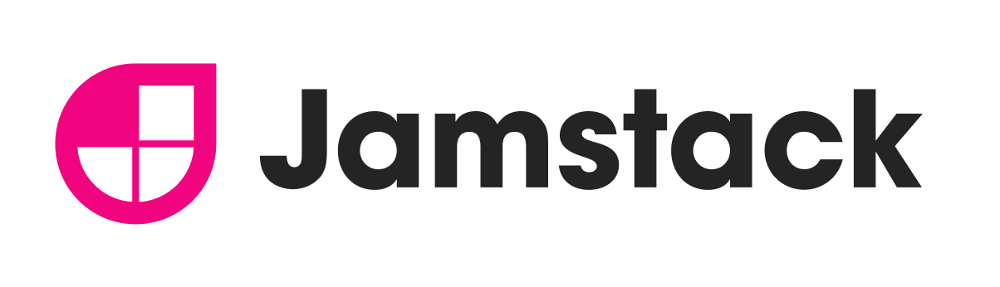

<section id="table-of-contents" class="toc">
  <header>
    <h3>Overview</h3>
  </header>
  

  *  Auto generated table of contents
  {:toc}
  

</section>

## Remember traditional website hosting?

A while back I volunteered my software development services to help my triathlon club get on the web and maintain their website. At that time, we were hosting our site the traditional way using shared hosting with [GoDaddy](https://au.godaddy.com/).

Nothing against them, however, I was getting exhausted going through the typical deployment process. Yes it was basically FTP, and while it worked, it was far from my favorite tasks during the week.  

## Enter Jamstack

Sometime later, I started hearing about static websites using frameworks like [Hugo](https://gohugo.io/) and [Jekyll](https://jekyllrb.com/) and how it may be an option for simple websites like blogs and brochure sites. 

I gave them a try, in fact I have moved this [blog](https://fullstackdeveloper.tips/) to Jekyll and Github pages.

That was great and it opened my eyes to the this 'new' architecture they call the [Jamstack](https://jamstack.org/) architecture.

**J** for Javascript, **A** for API, and **M** for Markup.

It was supposedly the modern way to build websites and apps that delivers better performance.

Based on what I experienced with [this blog](https://fullstackdeveloper.tips/) in Jekyll/Github pages - I loved the developer experience of markup editing, and simply pushing to git.

That's all I needed to make the updates public. However, I didn't really get to like using [Liquid](https://jekyllrb.com/docs/liquid/), the templating language used in Jekyll. At that time I was using React and React Native in my consulting projects, so I was yearning for a solution that used similar tools. 

That's when I heard about the successes at [Netlify](https://www.netlify.com/) promoting [Jamstack](https://jamstack.org/) with their git-based workflow and [GatsbyJS](https://www.gatsbyjs.com/) with their open source front end framework offering blazing fast performance.

## Jamstack - is it better?

I have taken the following 4 points straight from [Jamstack](https://jamstack.org/) and let me tell you why I agree:

### Better Performance

Sites created by a static site generator, like the ones built and deployed in Netlify, have better performance since the pages are pre-built and ready to load from any CDN. 

### Higher Security

Because there are no servers to maintain to house your pages, and leveraging the serverless architecture, your attack surface is vastly reduced. 

### Cheaper and easier to scale

Your deployment is basically made up of the pre-built html files that you can serve from any CDN, so the cost savings compared to the traditional hosting providers is substantial.

### Better DX (developer experience)

I have come to love the simplicity of Netlify, Github, Gatsby and Markdown workflow. Just update markdown files, and push your changes to your source repo and Netlify will take care of the build and deployment without you lifting a finger. 

## How to start and get to production with $0

So to drag my [triathlon club's website](https://www.filoztri.com.au/) from FTP deployments, and of course to save money spent in shared hosting providers (about $200 per year), I suggested to move the site to Netlify, using Gatsby to get a super fast website for free.

And I did it in a few simple steps:

1. Create an account with [Netlify](https://www.netlify.com/). Because they have a very generous [free plan](https://www.netlify.com/pricing/), it has a very low barrier for entry.
 

1. Create an account with [Github](https://github.com/). As this is a git-based workflow, a git repository is required for this to work. It is free too.
 

1. For this website, since I was not going to be maintaining the site all the time, I had to provide an easier editor experience for other site editors. For me, using VS Code was awesome, however not for non-developers. So I used [Netlify CMS](https://www.netlifycms.org/) to achieve this. Here is the [guide I followed](https://www.netlifycms.org/docs/gatsby/). Using  Netlify CMS allowed other editors to update content from an Admin CMS interface. Netlify CMS is free too. 

1. Because it is still a git-based workflow, developer site maintainers like myself can continue to add content using markdown and git. 

1. Once I was happy with the website running locally, I was now ready to deploy it to Netlify. By default, they deploy it to a randomly generated domain name (eg. dfadfad-fadfa.netlify.com), however you can easily transfer it to your preferred domain name. Getting your custom domain cost money, but that is the only cash outlay for this project.

1. Result is a **free super-fast static generated website** based on the modern Jamstack architecture. The speed you get for free courtesy of GatsbyJS as performance is built-in the framework. I am pleased with that honestly, and yeah I was able to save the club **$200 per year**, how about that!

## Conclusion

Sites using the Jamstack architectures are awesome. Although they are called static sites, don't let the word 'static' fool you. There a many a static site that are far from static in behavior. For this particular case, swapping the hosting of this website from a traditional method to a Jamstack approach was a great strategy.

It allowed me to move to a cheap (free!) option without sacrificing any functionality. Because of the nature of static sites and the use of Gatsby with its web performance optimizations, the website rates very high up [Lighthouse](https://developers.google.com/web/tools/lighthouse) performance audit and the latest [Core Web Vitals](https://web.dev/vitals/), and since it gives great DX, then I'm all for it!

## Resources
- [Gatsby Netlify CMS Starter](https://www.gatsbyjs.com/starters/netlify-templates/gatsby-starter-netlify-cms){:target="_blank"}
- [Netlify CMS](https://www.netlifycms.org/){:target="_blank"}
- [What is the JAMstack and how do I get started?](https://www.freecodecamp.org/news/what-is-the-jamstack-and-how-do-i-host-my-website-on-it/){:target="_blank"}
- [5 Reasons Static Sites Rock!](https://scotch.io/bar-talk/5-reasons-static-sites-rock){:target="_blank"}