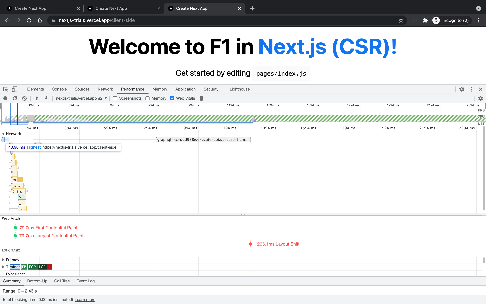

<section id="table-of-contents" class="toc">
  <header>
    <h3>Overview</h3>
  </header>
  

  *  Auto generated table of contents
  {:toc}
  

</section>

## A Quick introduction to NextJS

In the [last blog post](../penny-pinching-using-jamstack/), we were talking about the use of GatsbyJS as an option to create modern performant websites in the React ecosystem. It was created with performance in mind and get around the issues that were typical of client rendered javascript. 

In this article, we will be introducing [NextJS](https://nextjs.org/), a modern Javascript framework with similar objectives as GatsbyJS, however, while the latter focuses on the static generation of pages, NextJS has a more complete approach where it focuses on great DX (developer experience), fuss-free NextJS deployment, static generation, server side rendering and a combined (static and server-rendered) hybrid model. And of course client side rendering since it is after all still a React application.

## Let's talk about Web Performance

NextJS is a feature rich framework, and has many capabilities, however, we will be talking about the different pre-rendering options that make it a popular choice for many builders like myself. Of all its features, this is probably what makes it [the most popular](https://jamstack.org/generators/) of the static site generators available today. 

## Comparison of the different pre-rendering options in NextJS

For this article, I have built a [small project](https://github.com/jaeyow/nextjs-trials) to illustrate these pre-rendering options. This article, like all the ones I have created in this website, are really future notes to myself disguised as blog posts. So I do hope that you will find these tips useful, as much as I had fun researching and trying them out.

If you want to follow along, please clone the above project to your local development environment and open the folder with VSCode. 

In addition to the above project, we are also using an API that I have created for a past article when I was [trying out GraphQL here](../6-steps-to-your-first-graphql-server/). It is always cool to be able to build up on previous work, so whenever I can use these efficiencies, I take advantage of them.

> This is [the GraphQL API](https://kc4uqd938e.execute-api.us-east-1.amazonaws.com/dev/graphql) we are using in this exercise. Please play around with it and get familiar with the data.

So I needed an API and the quickest way for me was to use one that I already have deployed previously. I have wired up that GraphQL API here and used Apollo client to make is as quick and simple as possible.

### Static Site Generation

First, let's have a look at static generation in our sample NextJS application.

Have a play with the [Static Generated Page](https://nextjs-trials.vercel.app/){:target="_blank"} and view source on the browser. Notice that what you see on your browser is what the crawlers see too, so its is excellent for SEO. However, since this page is generated at build time, the content may be stale, and you will need another build (and deploy) to keep your site current. Yes this is a hassle, but there are some strategies to cover us in this situation. 

Just like GatsbyJS, NextJS supports static generation of content and this is the pre-rendering method that gives you the greatest improvement in page speed. This is in addition to the SEO benefits that make the page content available to the web crawlers. As the page is created ahead of time when the page is built, there is no speed penalty of the server creating the html content and sending it back to the clients.


export async function getStaticProps() {       // to static generate
  console.log('Build Time: getStaticProps')
  const { data } = await client.query({
    query: gql`
      query {
        races {
          season
          round
          raceName
        }
      }
    `,
  });

  return {
    props: {
      races: data.races.slice(0, 6),
    },
  };
}


Above shows a [code snippet from the SSG page](https://github.com/jaeyow/nextjs-trials/blob/main/pages/index.js), showing that NextJS allows you to also get some data at build time (ie. using an API, read from DB, or from a file) in the process of generating the static html. NextJS makes this all possible using NextJS' [`getStaticProps`](https://nextjs.org/docs/basic-features/data-fetching). This is a function that NextJS calls at build time, so all you have to do is return `props` and that data will be available to your application.

> The image above shows the complete html page come back to the client in 51.32 ms, super quick as this is the page that NextJS has pre-generated for us when the application was built by `next build`. Core Web Vitals metrics - [First Contentful Paint (FCP)](https://web.dev/fcp/) and [Largest Contentful Paint (LCP)](https://web.dev/lcp/) comes back at 91.5 ms which is awesome, and Lighthouse did not detect any [Layout Shift (LS)](https://web.dev/cls/) at all.

In NextJS, if all you have in your project is a static site, where you do not need any real time functionality, then you are set. All you really need to do is run the command `next build && next export` and NextJS will build your static website where you can simply deploy this to any CDN, or even your S3 bucket or Blob storage. More info here about this [functionality](https://nextjs.org/docs/advanced-features/static-html-export). 

### Server Side Rendering

This is where NextJS shines, of being able to serve content rendered on the server side. This used to be only possible with server side web frameworks like .Net and PHP, however this is well and truly possible in React, Now. 

Check out our [Server Side Rendered Page](https://nextjs-trials.vercel.app/server-side){:target="_blank"}. If you have noticed, it still feels quick to load like our statically generated page in the previous section. And if you view source once again, it will be identical to its statically generated version. 

> The main difference is this method calls the API in real time, it calls the API the moment one loads the page. If you have a closer look at the image below, you will see that the page responds a bit slower at 374.82 ms, and FCP and LCP a bit slower at 418.8 ms, however, this is NOW server side rendering in real time. This delay accounts for the API call and NextJS building up the content on the server before responding the browser.


export async function getServerSideProps(context) {    // to server side render
  console.log('Server Side: getServerSideProps')
  const { data } = await client.query({
    query: gql`
      query {
        races {
          season
          round
          raceName
        }
      }
    `,
  });

  return {
    props: {
      races: data.races.slice(0, 8),
    },
  };
}


Above shows [code required](https://github.com/jaeyow/nextjs-trials/blob/main/pages/server-side.js) to be able to call the API to make server side rendering work. We just need to call the NextJS function called [`getServerSideProps`](https://nextjs.org/docs/basic-features/data-fetching) and return props to the application. 

### Client Side Rendering

The last topic for today's article will be about client side rendering, and this is somewhat similar to normal React applications with a fundamental difference. By default, NextJS static generation for all pages. However, there are instances where one would like to avoid pre-rendering content. 

Imagine you have an e-commerce site and you have logged in and looking at your shopping cart. You definitely would not want that information statically generated since that page contains personal information. You probably don't need it server side generated too, since you will not need any SEO benefits in this case. 

Another option is to employ client side rendering on this page. Since NextJS uses static generation by default, any page page that we create is pre-rendered by NextJS. Once the skeleton html has been mounted at the client, we can then re-hydrate it with our client side rendered code. 

Have a play with our [Client Side Rendered Page](https://nextjs-trials.vercel.app/client-side){:target="_blank"}. You will notice that the header section displays instantly, while the F1 section towards the middle of the page displays after some small delay. That part is due to the client side rendering. 

Instead of the usual flash of empty screen in a typical React application, we can display part of the application to the user and hydrate the UI with the rest using this client side rendering technique. 

> Image above shows the client rendered page in action. The statically rendered part returns to the browser in speedy 40.90 ms, and we have achieved FCP and LCP of 79.7 ms. However, notice the delayed call to the GraphQL API. Client side rendering is also an option where we can quickly return some content, then rehydrate to complete the page. 

I have the [client side code](https://github.com/jaeyow/nextjs-trials/blob/main/pages/client-side.js) available here too. We have used `useEffect` hook to ensure that we are calling the API only on the client side. 

## Conclusion

I wanted to explore NextJS to see what the fuss was all about. There is a reason why this React framework is one of the most popular out there now. I have seen the improvements in developer experience and the awesome convenience in its deployment options in [Vercel](https://vercel.com/), and in [Serverless](https://www.serverless.com/), for that matter. However this blog post is not about all that. Perhaps we will cover them in a future post. 

For this post, we wanted to check out the pre-rendering options that NextJS offers. From static generation, which NextJS does automatically for all pages.

To server side rendering - no more will React be just a front end framework. NextJS has smartly merged NodeJs seamlessly so that we are NOW working on React Full Stack. How awesome is that, although there is a bit of mind shift there I do admit.

Lastly, we have covered client side rendering, which because it is still a React app after all, is still available as an option for us. 

## Resources
- [The React Framework for Production](https://nextjs.org/){:target="_blank"}
- [Getting Started With Apollo Client in Next.js](https://www.apollographql.com/blog/apollo-client/next-js/next-js-getting-started/){:target="_blank"}
- [The Perils of Rehydration](https://www.joshwcomeau.com/react/the-perils-of-rehydration/){:target="_blank"}