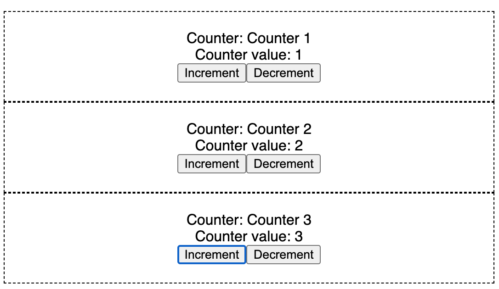

<section id="table-of-contents" class="toc">
  <header>
    <h3>Overview</h3>
  </header>
  

  *  Auto generated table of contents
  {:toc}
  

</section>

- [Github Repo here](https://github.com/jaeyow/global-vs-local-context){:target="_blank"}
- [Code Sandbox here](https://codesandbox.io/s/xifmu){:target="_blank"}

## Typical usage of React Context

React 16 introduced Context API as a means to share data among multiple components, regardless of its depth in the component hierarchy.

With the introduction of Hooks, it can effectively be used as a replacement for Redux, in cases where you don't want to bring in an external dependency, or when the complexity of Redux makes you dizzy.  

In this short article, let's investigate why React Context did not quite work as we intended, and what we did to fix that.

## Defining your Context and Provider

Below I have created a Context Provider for our simple application. This context provides a counter and functions to increment and decrement its value. We also have a counter name and its setter. This code is also available [in this Code Sandbox](https://codesandbox.io/s/xifmu){:target="_blank"}.

 
import React, { useState } from "react";

const defaultValue = {
  counter: 0,
  incrementCounter: () => {},
  decrementCounter: () => {},
  name: "",
  setName: () => {}
};

export const AppContext = React.createContext(defaultValue);

const AppContextProvider = (props) => {
  const [counter, setCounter] = useState(0);
  const [name, setName] = useState("");
  return (
    <AppContext.Provider
      value={
        counter,
        incrementCounter: () => {
          setCounter((ctr) => ctr + 1);
        },
        decrementCounter: () => {
          setCounter((ctr) => (ctr > 0 ? ctr - 1 : 0));
        },
        name,
        setName
      }
    >
      {props.children}
    </AppContext.Provider>
  );
};

export default AppContextProvider;



The Context Provider is meant to wrap your consumer components with it so that the context will be made available to all components wrapped by it. 

## Consuming your Context

First we have a **Card** component that renders our card component containing our counter and buttons to increment and decrement it. The **useContext** call brings in **AppContext** into this component.

You know when a component state and props changes, the component re-renders? This is the same with components that consume a context. When the context changes, the component that consumes that context will get a re-render to give it a chance to update itself.


import { useContext, useEffect } from "react";
import { AppContext } from "./AppContext";

export const Card = ({ name }) => {
  const context = useContext(AppContext);
  useEffect(() => {
    context.setName(name);
  });

  return (
    <>
      
{`Counter: ${context.name}`}

      
{`Counter value: ${context.counter}`}

      <button onClick={context.incrementCounter}>Increment</button>
      <button onClick={context.decrementCounter}>Decrement</button>
    </>
  );
};



In the snippet below, I have wrapped each consumer component **Card** with our **AppContextProvider**. I want to create 3 counters that all point to the same global context. 

However, to my surprise the code below does not work as intended. Can you guess why?


import AppContextProvider from "./AppContext";
import { Card } from "./Card";
import "./styles.css";

export default function UsingContext() {
  const counters = [1, 2, 3];
  return (
    

      <h1>Using React Context</h1>
      {counters.map((c) => {
        return (
          

            <AppContextProvider>
              <Card name={`Counter ${c}`} />
            </AppContextProvider>
          

        );
      })}
    

  );
}



Clicking any of the Increment or Decrement button is meant to update the counters. Since all the counters are supposed to be pointing to the same context, all the counters should change together. However this isn't what is happening. 

It turns out that in the above code, we are actually creating 3 separate contexts. And **useContext** will get the context of the first Context provider up the hierarchy.

To fix this issue, instead of creating multiple contexts, we need to move the **AppContextProvider** up the tree to create the single context, effectively creating the global context that all the counters share. Like so: 


import AppContextProvider from "./AppContext";
import { Card } from "./Card";
import "./styles.css";

export default function UsingContext() {
  const counters = [1, 2, 3];
  return (
    

      <h1>Using React Context</h1>
      <AppContextProvider>
        {counters.map((c) => {
          return (
            

              <Card name={`Counter ${c}`} />
            

          );
        })}
      </AppContextProvider>
    

  );
}



## Conclusion

In this post I have demonstrated how to create a Context, wrap a component hierarchy in it so that it functions as a Context Provider. 

We have also seen how easy it is to consume that context from a component under that hierarchy. Once a component has been made a context consumer, that component will then get a re-render when it detects changes to the context, similar to when a state or props changes in a React component.

Care must be taken though when creating that provider. You can create multiple instances of that context, so that each instance will have its own separate state. However, if your intention is to create a Global context, create one copy of the context just like when you create a global Javascript variable. 

## Resources
- [React Context API](https://reactjs.org/docs/context.html){:target="_blank"}
- [An Introduction the React's Context API](https://www.smashingmagazine.com/2020/01/introduction-react-context-api/){:target="_blank"}
- [A Deep Dive into React's Context API](https://blog.logrocket.com/a-deep-dive-into-react-context-api/){:target="_blank"}