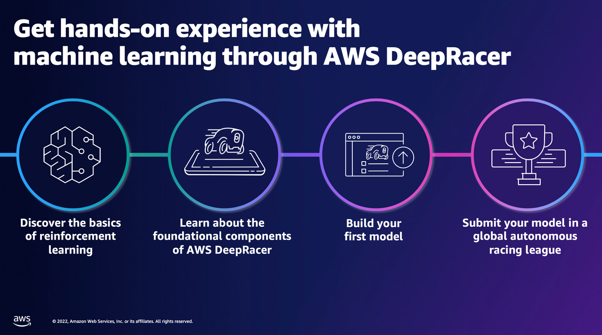

<section id="table-of-contents" class="toc">
  <header>
    <h3>Overview</h3>
  </header>
  

  *  Auto generated table of contents
  {:toc}
  

</section>

## AWS Summit 2022 - AI/ML Edition

This is my Day 1 report for the AWS Summit which is an all Online event this year.

Even if the event was a real face-to-face conference, I would still have been attending the sessions online, since coincidentally, I've very recently contracted Covid, and I am still recovering as I'm typing this report.

<figure>
	<figcaption>AWS Summit 2022 Australia and New Zealand</figcaption>
</figure> 

I make no secret that my goal in the next 12 months is to build up Machine Learning skills and find projects that will exploit these newfound skills. So many of my learning activities this past year have been about this field, and the effort is still continuing. Imagine my surprise when I found out that the AWS Summit has a good chunk of sessions focusing solely on AI/ML!

Out of about 104 sessions, 28 are about AI/ML, I thought that was great, so this for year's AWS Summit, that's where my focus will be. Obviously I could not have attended all 28 sessions, just the ones that I fancied and handpicked from the agenda. 

## Day 1 AI/ML Sessions

### **Jumpstart the machine learning journey with Canva**

The first session is a peek into how Canva approached scaling ML in their company. As a newcomer in the filed of ML, it was 

This can be summarized into 5 main points, please see image below. When the AWS Summit videos are made available, I will post their links here. 

- **Team Enablement** - involves defining culture, team training (and hackathon), and tools

- **Data Strategy** - involves training, best (data) practice

- **Proof of Concept** - involves training, business alignment, cross functional teams

- **Repeatability** - involves training, tools, cloud enablement, MLOps

- **Scale** - involves training, Center of Excellence, optimization

<figure>
	<figcaption>Best Practice in Scaling ML in Canva</figcaption>
</figure> 

### **Solving business challenges with AI - powered by Intel on AWS**

AWS and Intel have a deep partnership and together provide solutions to real world customer problems. Many of the these are related to AI and ML, such as in the development of hardware chips that provide faster, more powerful performance that is cheaper and more sustainable to run. 

<figure>
	<figcaption>AWS and Intel Partnership</figcaption>
</figure> 

### **End-to-end MLOps for architects**

This session introduces the concept of Machine Learning Operations (MLOps) in Data Science/Machine Learning teams. As the team's AI maturity improves, it becomes more and more important to integrate MLOps practices into your workflow to avoid the problems of POCs not making it into production.

Issues like manual intervention for changes, work stuck in Jupyter notebooks, not enabling autoscaling, or having no feedback on model performance are only some of the issues that contribute to the failure of your ML system. 

We were then presented with 3 MLOps architectures, from Small, Medium and Large, which represents architectures that one would adopt, depending on your team's AI maturity, and budget. 

<figure>
	<figcaption>End to End MLOps for Architects</figcaption>
</figure> 

### **Sustainability powered by AI and machine learning**

In re:Invent 2021, AWS announced that [Sustainability](https://aws.amazon.com/blogs/aws/sustainability-pillar-well-architected-framework/) as the latest pillar added to the 5 existing: Operational Excellence, Security, Reliability, Performance Efficiency and Cost Optimization. It was nice to see sustainability being more and more involved in presentations, so it was one that I was looking forward to hear. 

Leadership is crucial if sustainability initiatives are to succeed. To adopt a sustainability mindset, direction from leaders is a requirement. From there the company can enable teams, adopt a powerful data platform such as AWS, and finally choosing the right first project. 

The session also showed an example in an industrial setting of one Amazon.com's buildings. The problem was to improve the current system's power consumption by 8% and achieved that by creating a model based on Reinforcement learning and Amazon SageMaker suite of tools. 

<figure>
	<figcaption>Sustainability in AWS</figcaption>
</figure> 

### **Kick-start your ML journey: Get hands-on with AWS DeepRacer**

Not everyday does one have the chance to develop systems used in autonomous vehicles and AWS have just given every developer the ability to do so in [DeepRacer](https://aws.amazon.com/deepracer/)! Using [Amazon SageMaker](https://aws.amazon.com/pm/sagemaker/) and Intel's [OpenVINO](https://docs.openvino.ai/latest/index.html) toolkit, Reinforcement learning can be used to train your models, after which it can be run in the DeepRacer 3D racing simulator.

<figure>
	<figcaption>AWS DeepRacer League</figcaption>
</figure> 

Also, AWS has purpose-built a real 1/18th scale race car, so that you can use it to download your models to, and race against the autonomous racing league. 

<figure>
	<figcaption>Hands-on with AWS DeepRacer</figcaption>
</figure> 

## Summary

That's a wrap for Day 1 of the AWS Summit 2022 Australia and New Zealand. I've got two highlights for today.

**First** is seeing how AWS SageMaker is being positioned by Amazon at the center of their AI/Machine Learning story - as an end to end MLOps framework. When I learned about [Data Science in a course](https://fullstackdeveloper.tips/tags/#) I completed towards the end of 2021, I was not made aware of such tool available, and rightly so. It would have made the course more difficult than it was.

And **next** was seeing DeepRacer - truly making Machine Learning (Reinforcement Learning) accessible to developers the world over.

Keep an eye out for my Day 2 wrap later!

## Resources
- [AWS Summit 2022 - Australia and New Zealand](https://summit-anz22.virtual.awsevents.com/){:target="_blank"}