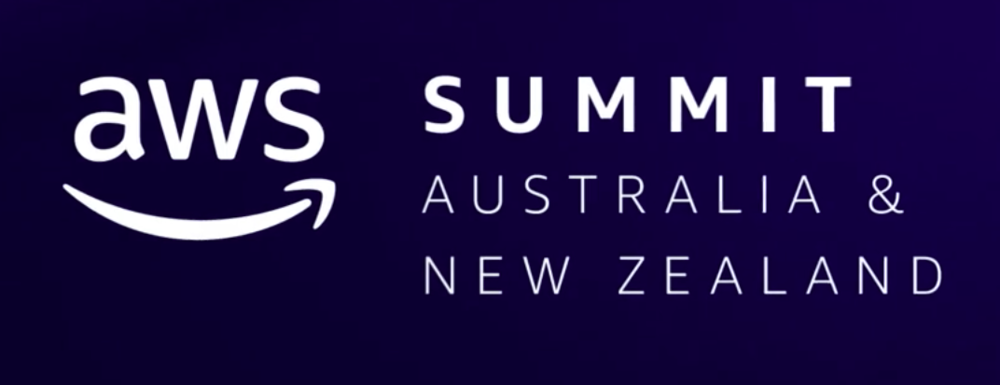
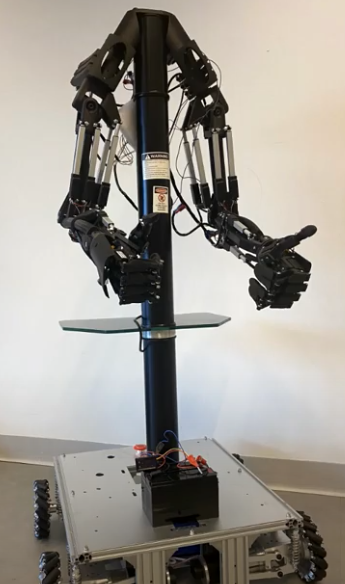
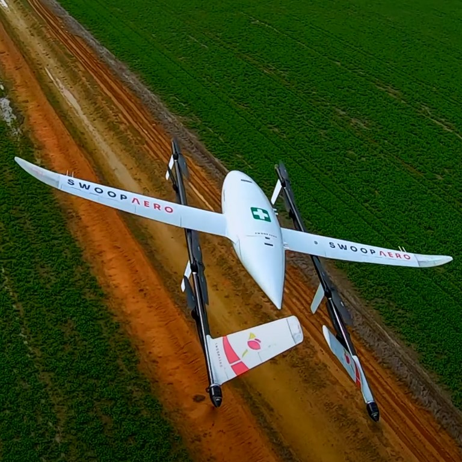
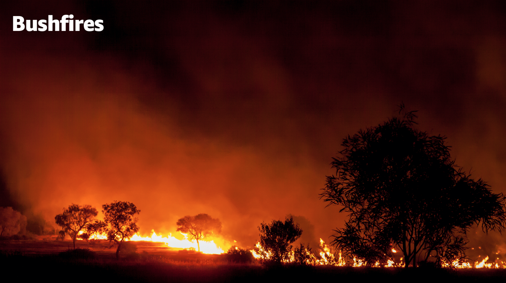
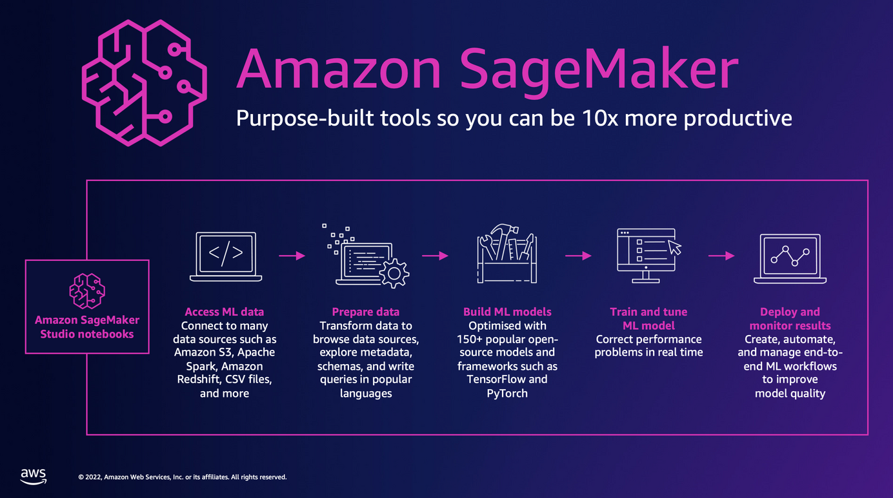
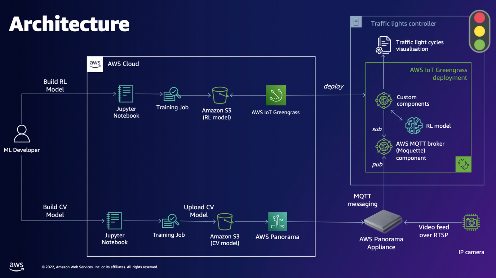
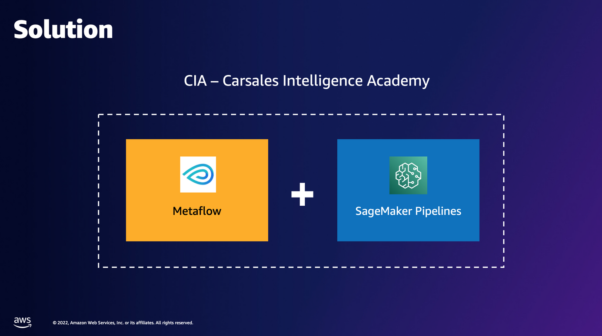

<section id="table-of-contents">
  <header>
    <h3>Overview</h3>
  </header>
  

  *  Auto generated table of contents
  {:toc}
  

</section>

## AWS Summit 2022 - AI/ML Edition

This is my Day 2 report for the AWS Summit 2022 AU and NZ.

<figure>
	<figcaption>AWS Summit 2022 Australia and New Zealand</figcaption>
</figure> 

I make no secret that my goal in the next 12 months is to build up Machine Learning skills and find projects that will exploit these newfound skills. So many of my learning activities this past year have been about this field, and the effort is still continuing. Imagine my surprise when I found out that the AWS Summit has a good chunk of sessions focusing solely on AI/ML!

## Day 2 AI/ML Sessions

### **Day 2 Keynote**

In the Day 2 Keynote, Simon Elisha - ANZ Chief Technologist, was talking excitedly about a few cloud advancements but it was these AWS Partner's presentations that attracted my attention:

### *Franky - the stroke rehabilitation robot*

[Franky](https://aws.amazon.com/blogs/iot/how-the-university-of-technology-sydney-is-transforming-stroke-rehabilitation-with-biomedical-robots-and-aws-iot/) is an at-home rehabilitation robot for stroke patients that uses AWS IOT and Machine Learning among other technologies.

<figure>
	<figcaption>Franky - the stroke rehabilitation robot</figcaption>
</figure>

In early trials, Franky is showing the benefits of using AWS IoT by saving patients travelling time, improving data collection, and avoiding physical contact with patients during the pandemic.

### *Swoop Aero - making access to the skies seamless*

<figure>
	<figcaption>Swoop Aero - making access to the skies seamless</figcaption>
</figure>

[Swoop Aero](https://swoop.aero/) is one cool company, using cool technology. It has been used all around the world to as a world-leading drone logistics service, delivering anywhere on the planet, all from there operation HQ in Melbourne!

All made possible by [proprietary drone aircraft - Kite](https://swoop.aero/kite), AI technology and digital twin based on AWS.

### **Reduce bushfire risk with machine learning at scale**

The damage and loss caused by bushfires every year is in the excess of tens of millions of hectares and would have cost billions of dollars to the economy. It has been identified that one of leading cause of bushfires originate from the energy supply network, ie. the millions of kilometers of power lines all around the country. 

To improve the process of asset inspection of these power poles nationwide, Machine Learning was used to replace the current method to ensure that the operation gets completed quicker and cheaper. The current method was very labor intensive and can't possibly scale easily nationwide. 

<figure>
	<figcaption>Reduce bushfire risk with machine learning at scale</figcaption>
</figure> 

### **Sepsis detection using model ensembles on Amazon SageMaker**

Through a project collaboration between the [NSW Government](https://www.health.nsw.gov.au/) and [University of Sydney](https://www.sydney.edu.au/) a project was undertaken to tackle the problem of diagnosing Sepsis in the emergency room. Sepsis is a leading cause of death in Australia, greater than the annual national road toll, breast cancer, prostate cancer, or colon cancer.

However if it can be diagnosed early enough, then most of these deaths will have been avoided. This session demonstrated the use of model ensembles (in this case 3 models - XGBoost, Linear Learner and Logistic Regression), and [AWS SageMaker](https://aws.amazon.com/pm/sagemaker/), Amazon's machine learning platform. 

<figure>
	<figcaption>Sepsis detection using model ensembles on Amazon SageMaker</figcaption>
</figure> 

### **Traffic signal optimization with Machine Learning on AWS**

This next session was quite interesting as it combines IOT, Edge, reinforcement learning and computer vision all in the same project,  aiming to replace the current decades old technology being used in our roads.  

There is a need to optimize the current state of things because our city's livability has now been affected. Pollution, Noise, accidents, and congestion, there has to be something that can be done with these.

[AWS IoT Greengrass](https://aws.amazon.com/greengrass/) allows one to manage their IOT Edge devices, download ML models locally, so that inference can then be also be done locally.

<figure>
	<figcaption>Traffic signal optimisation with Machine Learning on AWS</figcaption>
</figure> 

### **MLOps with Amazon SageMaker: Carsales journey to scale AI**

The last (and definitely not the least), is the talk from Carsales on how they scaled their Data Science/ML capability. As they don't have a large DS team but their projects that required Data Science were on the rise, they have demonstrated how they were able to:

- democratize the Data Science skill
- democratize the ML Engineer skill
- allow them to experiment at scale
- allow them to do flexible model deployment
- allow the reusability of models across teams

As a result of their new DS framework (based on a [Metaflow - a DS framework built at Netflix](https://metaflow.org/) and [AWS SageMaker Pipelines](https://aws.amazon.com/sagemaker/pipelines/)), they were able to free up their DS resources so that Software Developers were now trained and equipped to tackle their normal DS projects, at a ratio of **70%** DS/ML work was now completed by developers. This leaves the **30%** meatier and more difficult problems for the Data Scientists to tackle. 

<figure>
	<figcaption>MLOps with Amazon SageMaker: Carsales journey to scale AI</figcaption>
</figure> 

## Summary

A couple of highlights for today, first was the demo from the team at [Swoop Aero](https://swoop.aero/), and to think that they do all their world operations from their Melbourne HQ is just mind boggling.

And next is [Carsales](https://www.carsales.com.au/) as they were able to democratize the Data Science and Machine Learning, they magically enabled their developer team to tackle Data Science and Machine Learning projects. They developed a Data Science framework that enabled normal developers to work on DS/ML projects with little input from the DS team, which frees up the Data Scientists to work on the more difficult problems facing the business.

## Resources
- [AWS Summit 2022 - Australia and New Zealand](https://summit-anz22.virtual.awsevents.com/){:target="_blank"}