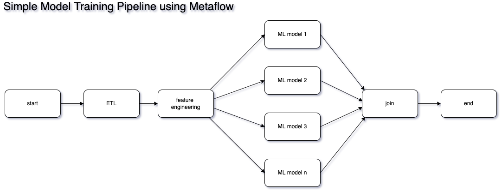

<section id="table-of-contents">
  <header>
    <h3>Overview</h3>
  </header>
  

  *  Auto generated table of contents
  {:toc}
  

</section>

## Quick recap of the AWS Summit ANZ

For me, one of the more memorable presentations in the recently concluded AWS Summit 2022 ANZ was the one where [Carsales described their strategy](https://fullstackdeveloper.tips/day-2-aws-summit-2022) in scaling their AI/ML Operations. They did not have a large Data Science team, as they had more and more Data Science projects, they needed an effective strategy for scaling their AI operations.  

It's undeniable that leadership is instrumental in any company and project success, however I was intrigued with one of their ML tool choices that helped them reach their goal. I was so curious about this choice that I just had to learn more about it, so in this article will be talking about a sound strategy of effectively scaling your AI/ML undertaking and a tool that makes this possible - [Metaflow](https://github.com/Netflix/metaflow).

## Why Metaflow

Metaflow was created in Netflix where they used it internally in demanding real-life data science projects and [was open-sourced](https://github.com/Netflix/metaflow) in 2019. And because of AWS tight experience with AWS, it plays really well with many AWS services, in fact these are all [described in detail here](https://docs.metaflow.org/metaflow-on-aws).

<figure>
	<figcaption>Metaflow by Netflix</figcaption>
</figure> 

As I researched about it and used it in a project we will be discussing shortly, I came to the realization that its secret I think is in its simplicity. But don't let this simplicity fool you. 

In a nutshell, Metaflow allows you to create DAGs ([Directed Acyclic Graph](https://en.wikipedia.org/wiki/Directed_acyclic_graph)), so we are now touching graph theory here, but in the end it is really just a fancy term for a workflow, but one that doesn't form a closed loop.

These DAGs, combined with Python, Serverless and Open stack, is a very powerful combination. This results in the democratization of the Machine Learning function, making it easier than ever to kick off that personal ML project, or scale your company's capability in the ML Space.

## Scalability

The typical machine learning process starts with simple experiments, mostly done on laptops or PCs, and this can easily be done with Metaflow. The realization of being resource constrained will come pretty quickly as soon as more complex algorithms or gigantic volumes of data come into the picture.

However, using the same Metaflow Python scripts (oh yeah you can use R too), plus a [sprinkling of decorators](https://docs.metaflow.org/metaflow/scaling-out-and-up), you will have the ability to leverage almost infinite cloud compute (both GPU and CPU), gigabytes of memory, and a long list of mostly open source SAAS/PAAS tools.

## Analysis Paralysis

Remember the feeling of trying to select a tool, but feel paralyzed of picking one for fear of being stuck with it forever? Metaflow will not only enable you to easily pick and integrate an ML tool to your project, it will also allow you to abandon that choice relatively easily once a better one comes along, and be rest assured that you are using a tool that was battle tested in Netflix.

This article comes with a simple [example project](https://github.com/jaeyow/metaflow-f1-predictor) and although the algorithms it needs don't require the resources that a more complicated model requires, it represents real world data, and was originally created when I started following Formula 1 more regularly and was looking for something that I can learn Data Science and ML with, and wouldn't mind spending countless of hours with.

However, if you want a more realistic problem, more worked-out open source examples are found [here](https://github.com/jacopotagliabue/you-dont-need-a-bigger-boat), and [here](https://github.com/jacopotagliabue/you-dont-need-a-bigger-boat), and hopefully you will believe me that you don't need to be the size of Google to be able to tackle these types of Data Science problems. 

## Example ML project with Metaflow

[The example project](https://github.com/jaeyow/metaflow-f1-predictor) I have here is a very simple workflow that although consumes real-world dataset, was really only created for learning purposes. Following image shows some of the technologies I used to get it working. 

<figure>
	
</figure> 

Most of the code is from my [General Assembly capstone project](https://fullstackdeveloper.tips/general-assembly-data-science-bootcamp-week-10/#) - where I go through the process of consuming data I have pulled from a public API, do a bit of feature engineering, integration with another popular Machine Learning tool called [Comet ML](https://www.comet.com/) and [Github Actions](https://github.com/features/actions), then train multiple algorithms in parallel, all repeatable since Metaflow keeps track of all experiment metadata. 

<figure>
	<figcaption>Simple Metaflow Training and Test Pipeline</figcaption>
</figure> 

The intention is to show how easy it is to leverage Metaflow not just for orchestrating the parallel workflow, but also for enabling the repeatability of your experiments. It is also stops after training and testing phase, however, as with any Metaflow project, pushing to production can be done easily by extending the code that we already have.

Code is freely [available here](https://github.com/jaeyow/metaflow-f1-predictor). 

## Summary

The main disconnect with many new to Data Science and Machine Learning is the difficulty of shipping models to production. Many Data Science courses may teach you the basics of the whys and hows of using algorithms and model building, however, throw you to the wolves with deployment and scalability. With Metaflow it is easy to create ML pipelines for development when you're working locally, and when it is time to push it to production, there will be minimal work involved in moving that workload on the AWS cloud.

We saw how easy it was to create a workflow that performs feature engineering, model training and testing in parallel, and easily integrate 3rd party tools. This is only the tip of the iceberg, it really does enable one to have the ability to do ML using the open stack, 3rd party SAAS offerings, many free tools, and do ML at par with the big boys.

## Resources
- [MLOps at Reasonable Scale](https://www.youtube.com/watch?v=Ndxpo4PeEms){:target="_blank"}
- [You Don't Need a Bigger Boat](https://github.com/jacopotagliabue/you-dont-need-a-bigger-boat){:target="_blank"}
- [Machine Learning Trends You Need to Know](https://gradientflow.com/machine-learning-trends-you-need-to-know/){:target="_blank"}
- [Post Modern Stack](https://github.com/jacopotagliabue/post-modern-stack){:target="_blank"}
- [Effective Data Science Infrastructure](https://www.manning.com/books/effective-data-science-infrastructure){:target="_blank"}
- [You Do Not Need a Bigger Boat - Recommendations at Reasonable Scale in a (Mostly) Serverless and Open Stack](https://www.arxiv-vanity.com/papers/2107.07346/){:target="_blank"}
- [Metaflow](https://github.com/Netflix/metaflow){:target="_blank"}
