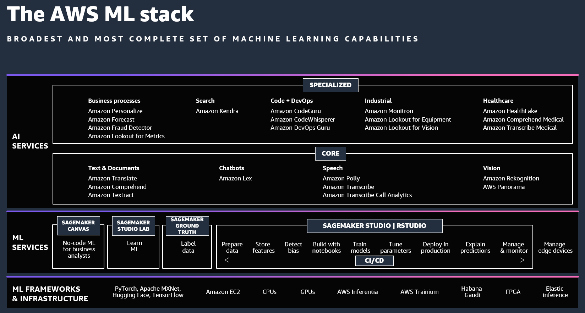
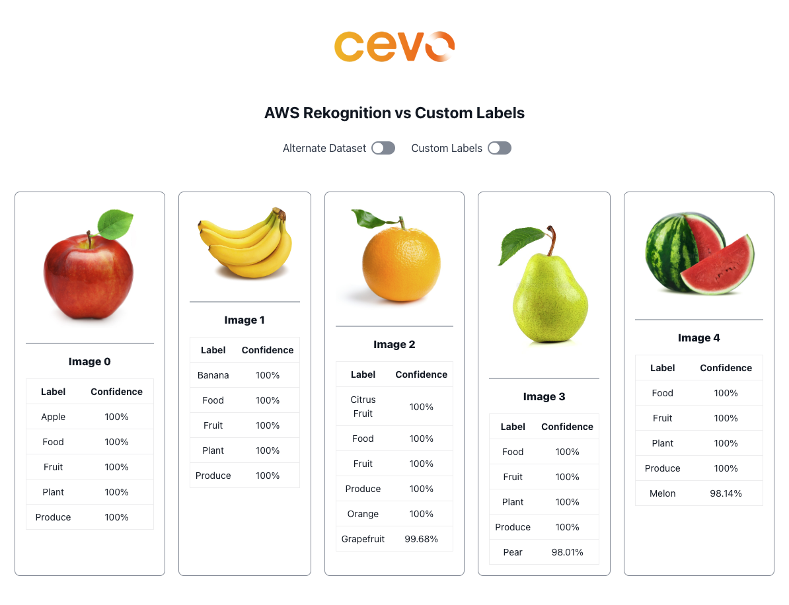
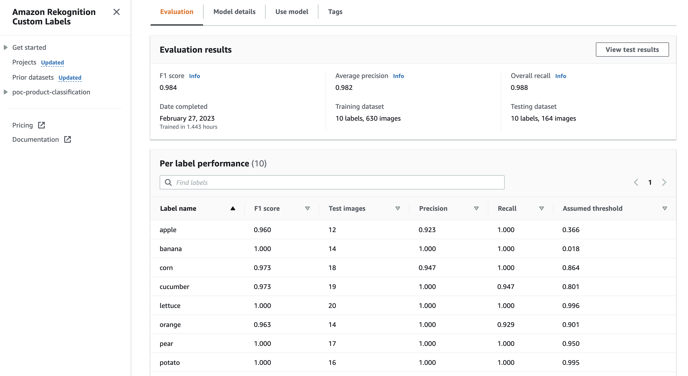
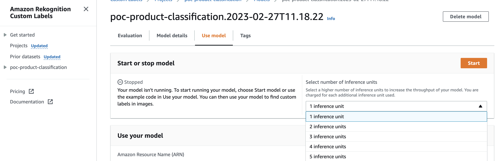
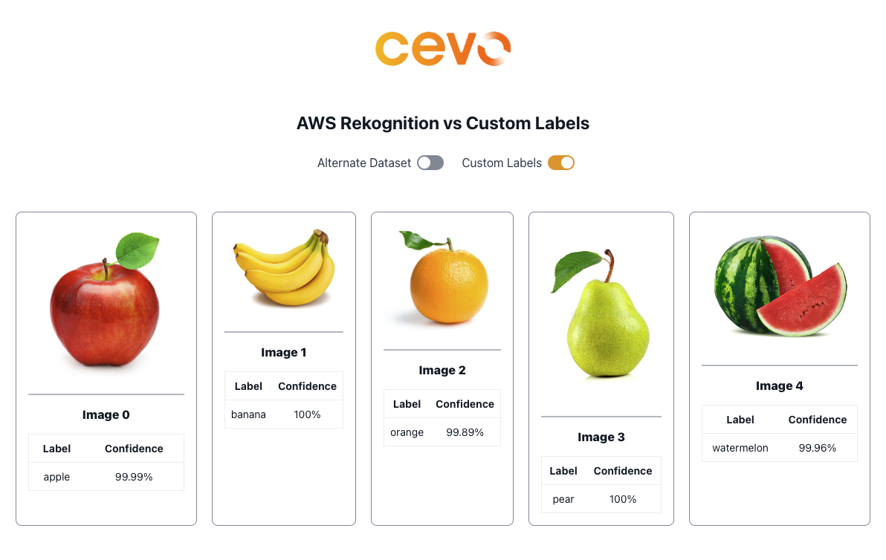

<section id="table-of-contents">
  <header>
    <h3>Overview</h3>
  </header>
  

  *  Auto generated table of contents
  {:toc}
  

</section>

## Part 1 - Undifferentiated Heavy Lifting

In 2006, [Jeff Bezos](https://en.wikipedia.org/wiki/Jeff_Bezos), the founder of [Amazon](https://en.wikipedia.org/wiki/Amazon_(company)), [delivered a keynote speech at an MIT conference](https://aws.amazon.com/blogs/aws/we_build_muck_s/), where he spoke about Amazon’s growth and his focus on helping entrepreneurs overcome obstacles in bringing their ideas to market. Despite already being a giant company, with only 10 distinct web services at the time, Amazon continued to rapidly expand.

During his speech, Bezos highlighted Amazon’s approach to building products that take care of what he referred to as the “undifferentiated heavy lifting” – the “muck” – the mundane yet necessary tasks required to create and operate a web application, such as server hosting, scaling, and network management.

It’s clear that Bezos recognised the importance of relieving entrepreneurs of the burden of non-value-adding tasks, so they could focus on developing and delivering products that truly differentiate themselves from their competitors. This philosophy has been a key driver of Amazon’s success, and has enabled countless entrepreneurs to turn their ideas into thriving businesses.

17 years have passed since that keynote conference, but Amazon’s commitment to simplifying tasks and empowering entrepreneurs remains steadfast. Nowhere is this more evident than in Amazon’s [vast array of machine learning offerings](https://aws.amazon.com/blogs/machine-learning/celebrate-over-20-years-of-ai-ml-at-innovation-day/), which cover a wide spectrum of specialised services, from the high-level to the more fundamental.

### AWS AI and ML Stack

As illustrated in the below image, Amazon’s machine learning services range from specialised, high-level offerings at the top, the more fundamental services at the centre, to the low-level machine learning frameworks and infrastructure at the bottom. This spectrum is designed to cater to the unique needs of [various data science personas](https://www.datacamp.com/blog/eight-personas-found-in-every-data-driven-organization), enabling them to leverage the power of machine learning with ease.

<figure>
	<figcaption>The AWS ML Stack, copyright Amazon</figcaption>
</figure>

Amazon’s continued investment in machine learning is a testament to their belief in its transformative potential for businesses and society at large. By offering such a comprehensive suite of services, Amazon is empowering data scientists and businesses of all sizes to harness the power of machine learning and drive innovation in a wide range of industries.

### Machine Learning System in Production

Turning our attention to the next image, we see a representation of a [machine learning system in production](https://cloud.google.com/architecture/mlops-continuous-delivery-and-automation-pipelines-in-machine-learning). The image highlights two crucial insights. Firstly, it emphasises that the machine learning component – herein labelled ML code – is only a small part of the overall system. While it’s undoubtedly a crucial component, it cannot create value without the other “lesser important” parts around it. In other words, a successful machine learning system requires a range of supporting infrastructure and processes.

<figure>
	<figcaption>Machine Learning System in Production, copyright Google</figcaption>
</figure>

Secondly, the image underscores the significant challenge of building and operating a machine learning system. It’s not just about having a team of skilled machine learning experts; it also requires a team of experienced infrastructure engineers who can design, build, and maintain the supporting systems necessary for a machine learning system to function at scale.

Taken together, these insights highlight the critical importance of developing and maintaining a robust ecosystem of talent, infrastructure, and processes to support machine learning systems in production. It’s a complex and challenging task, but one that is necessary for businesses to harness the transformative power of machine learning effectively.

>It's not just about having a team of skilled machine learning experts; it also requires a team of experienced infrastructure engineers who can design, build, and maintain the supporting systems necessary for a machine learning system to function at scale.

## Part 2 - Taking it for a spin
The second part of this article is taking Rekognition and Custom Labels for a spin. We build the application, including the frontend, backend and the CI/CD pipeline, all using [AWS Amplify](https://aws.amazon.com/amplify/). It really makes it quick to build full-stack apps that are secure, scalable and a pleasure to develop on. We won’t be delving too much with Amplify in the article, this post is all about machine learning after all. 

### Challenge for entrepreneurs

As we discussed in the previous section, entrepreneurs face significant challenges in bringing machine learning projects to market. Not only do they need to build and operate complex systems, but they also need to focus on customer acquisition and growth. To overcome these obstacles, one strategy is to leverage the capabilities of companies like AWS who can provide the necessary heavy lifting, like when Bezos highlighted in his speech 17 summers ago. 

For many entrepreneurs, the barrier to entry can be daunting, but there are solutions available. This is where the higher level AI services come into play. As we discussed previously, AWS offers a range of specialised services, each designed to address the needs of a specific machine learning or data science role.

In this article, we’ll focus our attention on [Amazon Rekognition](https://aws.amazon.com/rekognition/), and its powerful subset, [Amazon Rekognition Custom Labels](https://aws.amazon.com/rekognition/custom-labels-features/). By leveraging these services, entrepreneurs can dramatically reduce the complexity and overhead of building and operating vision machine learning systems, enabling them to focus on their core business and growth.

We’ve built a web application that classifies images of fruits and vegetables. It is a rather boring task, I know, however, if you look back at the previous image of the production machine learning system and attempt to build the same system from scratch, there is a lot that one needs to know and take into consideration.

### Accelerated application development

Using Rekognition and Custom Labels freed up our time to also work on the web application and get it up and running in production in about 24 hours. A full-stack machine learning web application built and deployed to production in 24 hours, how’s that for productivity? As a business owner, I would rather pass on the complexities of the building and maintaining the ML system to an expert and free myself to do more important and exciting things.

### Thoughts on Amazon Rekognition

Amazon Rekognition is a highly advanced AI service in AWS’s extensive range of computer vision solutions. It enables users to incorporate image and video analysis into their applications effortlessly, utilising cutting-edge deep learning algorithms, without requiring any specialised knowledge of machine learning.

With Rekognition, you can perform tasks such as identifying objects, people, text, and even detecting inappropriate content, all without the need to train a model yourself. This user-friendly service provides an efficient and straightforward way to incorporate computer vision capabilities into your applications.

By leveraging Rekognition, we were able to get our web application up and running quickly without the need to go through the rigorous process of building, training, and hosting models ourselves. Its pre-trained model accuracy is impressive and requires minimal effort to use. We simply sent API calls to [Rekognition API](https://boto3.amazonaws.com/v1/documentation/api/1.9.96/reference/services/rekognition.html#Rekognition.Client.detect_labels) from our web application.

<figure>
	<figcaption>Amplify App with Amazon Rekognition</figcaption>
</figure>

With Rekognition, there is very little effort required as there is absolutely no training involved. It is after all pre-trained on tens of millions of images, ready to use out of the box!

### Thoughts on Amazon Rekognition Custom Labels

The default Rekognition model can identify hundreds of classes, however what if we require it to identify only 10 classes?

For example, if we want to classify an image amongst a fixed list of categories (ie, orange, apple, banana, pear only), and not others, we may not want to identify cats or dogs, this is when Rekognition Custom Labels comes into the picture. 

Amazon Rekognition Custom Labels is a powerful extension to Rekognition that enables users to identify specific objects in both images and videos based on their unique needs. Custom Labels builds on Rekognition’s existing training data, which includes tens of millions of images.

As a result, users only need to provide a small set of images to train their model, without having to start from scratch. The training process is incredibly user-friendly and straightforward, requiring only a single click of a button. With Rekognition Custom Labels, you can customise your computer vision capabilities to meet most of your specific needs with minimal effort.

### Custom Model Training

The following image shows Custom Labels training results, where for a **train/test** split of **630/174** images, or **80/20** split, the model training completed in 1.44 hours, and an **F1 score of 0.984**. I must admit that it’s a bit slow, however, knowing that it is performing transfer learning and tuning on deep learning algorithms under the covers, it’s actually doing a lot, so that we don’t have to.

<figure>
	<figcaption>Rekognition Custom Labels Training</figcaption>
</figure>

When deciding to use Custom Labels, it’s important to note that it has a limit of 250 classes per dataset. This limit can be a significant limitation for some projects, so it’s essential to keep this in mind going forward. To get the custom labels for the input images, we used [Rekognition Custom Labels API](https://boto3.amazonaws.com/v1/documentation/api/1.18.53/reference/services/rekognition.html#Rekognition.Client.detect_custom_labels) similar to how we did it with the Rekognition example.

### Inference options
Unlike the models that you train with [Amazon SageMaker](https://aws.amazon.com/sagemaker/), the output of Rekognition’s training cannot be hosted outside of Rekognition. This means that we will be bound by the Rekognition pricing model, since we will not be able to host the model ourselves.

In the image below, hosting the model for inference is as easy as selecting the number of inference units, depending on your throughput requirements, and this defaults to 1 inference unit. There is some [guidance for choosing the right number for IUs here](https://aws.amazon.com/blogs/machine-learning/calculate-inference-units-for-an-amazon-rekognition-custom-labels-model/), so please consult it for more details.

<figure>
	<figcaption>Custom Labels Inference Units</figcaption>
</figure>

In the following image, Rekognition Custom Labels is seen returning a single label, showing its predicted label and confidence level in the returned API response. Once the training has completed, it is really easy to add image recognition to your application, it’s really just a simple API call.

<figure>
	<figcaption>Amplify App with Amazon Rekognition Custom Labels</figcaption>
</figure>
 

## Conclusion

In this article, we have seen the [vast range of ML and AI services offered by AWS](https://aws.amazon.com/blogs/machine-learning/celebrate-over-20-years-of-ai-ml-at-innovation-day/), a spectrum of services designed to allow customers to focus on their core business goals. We have also discussed the challenges associated with building and operating a machine learning system in production, which requires significant expertise in ML and infrastructure.

We took Rekognition and Custom Labels for a spin when we built a simple full stack web application and deployed it to production in 24 hours. 

For entrepreneurs looking to bring their products to market quickly, time to market is critical. With all these challenges, now is the perfect time to leverage the expertise of a giant like Amazon. By leaning on their expertise and allowing them to handle the heavy lifting, we can quickly bring our products to market without worrying about the complexities of building and managing these systems ourselves.

Note: This article was originally published on [Cevo Australia's website](https://cevo.com.au/post/accelerate-ml-application-development-in-aws/)
