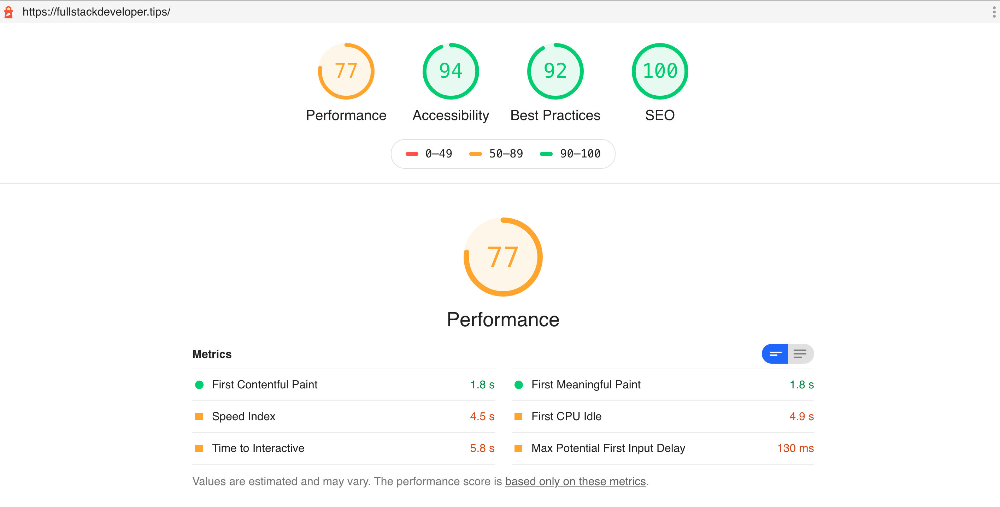
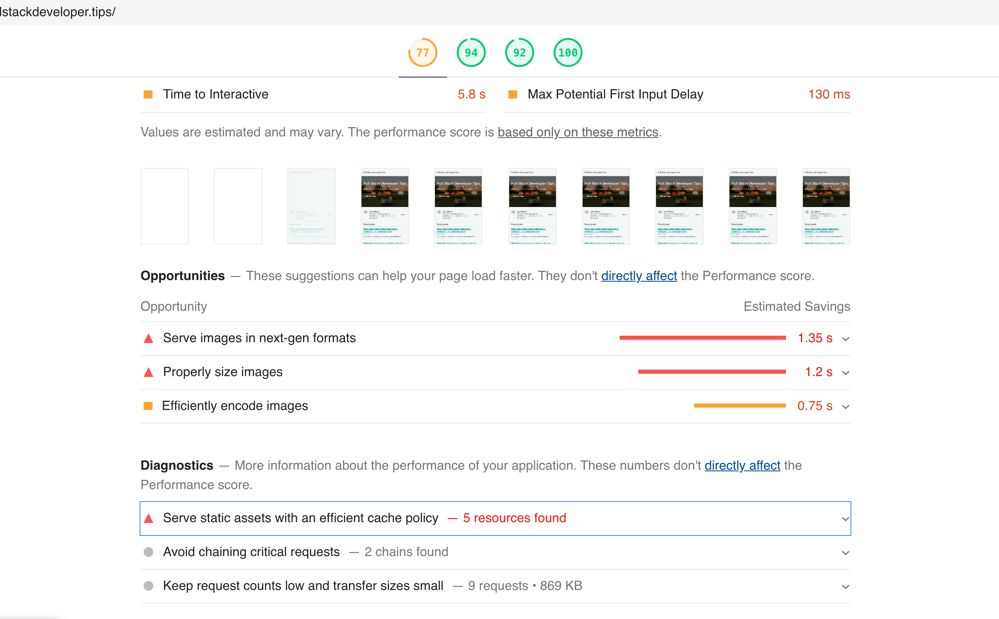
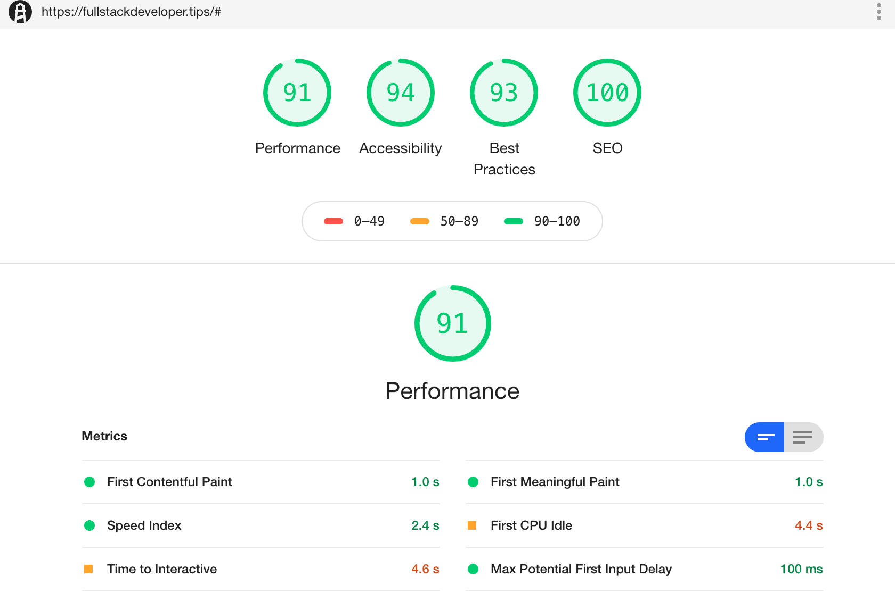

<section id="table-of-contents" class="toc">
  <header>
    <h3>Overview</h3>
  </header>
  

  *  Auto generated table of contents
  {:toc}
  

</section>

## Part of the [Website Performance Series](../tags/#web-performance)

## Running Lighthouse against this blog 
We're back to continue the [Website Performance Series](../tags/#web-performance), after discussing a [leadership topic](../website-performance-series-part-4/) in the last update. I received good feedback from that, getting some readership from people who normally would not spend time in technical blog like this.

In this installment, we will be running Lighthouse against this blog, and see if we can implement some improvements identified by the tool. I know that this is a pretty tiny website, however the principles will remain the same. It is good that I can demonstrate this in a much smaller scale, small baby steps that will increase our familiarity with the tool, and of course our confidence as we apply these learnings in your own projects. 
<figure>
	<figcaption>Figure: Fullstack Developer Tips Lighthouse results</figcaption>
</figure>

We didn't really do too bad, with a Performance score of 77, which positions us in the orange rating, however green is better, right?. Also we have scored favorably with the other categories - Accessibility, Best Practices and SEO. If you recall the [Lighthouse metric weights](../website-performance-series-part-3/) that we covered in Part 3, the highest weight at 5x is Time to Interactive (TTI). It is not immediately obvious what exactly is required to better our TTI results, however, Lighthouse has given us some tips in the next section of the report.

## Opportunities for improvement according to Lighthouse
For this simple site, there is just one major issue category really. All the opportunities for improvement is related to the site images. Obviously our use the [Minimal Mistakes Jekyll](https://mmistakes.github.io/minimal-mistakes/) theme helped a lot in us scoring highly in the other categories. These minor image issues are caused by no other than yours truly, but they were quite easy to rectify*.
<figure>
	<figcaption>Figure: Lighthouse opportunities for improvement</figcaption>
</figure>

### Serve images in next-gen formats

### Properly size and encode images

### Load 3rd party JS faster

### Consider using gzip compression

<figure>
	<figcaption>Figure: Lighthouse improvements</figcaption>
</figure>
  
## Conclusion 

## Resources
- [Let's build the future of the web](https://web.dev/)
- [Optimizing Web Performance](https://speckyboy.com/optimizing-web-performance/)
- [How speed affects website](https://hostingtribunal.com/blog/how-speed-affects-website/)

  
