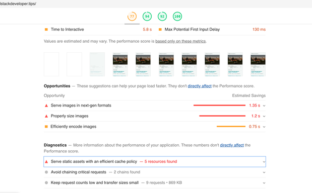

<section id="table-of-contents" class="toc">
  <header>
    <h3>Overview</h3>
  </header>
  

  *  Auto generated table of contents
  {:toc}
  

</section>

## Part of the [Website Performance Series](../tags/#web-performance)

## Running Lighthouse against this blog 
We're back to continue the [Website Performance Series](../tags/#web-performance), after discussing a [leadership topic](../website-performance-series-part-4/) in the last update. I received good feedback from that, getting some readership from people who normally would not spend time in technical blog like this.

In this installment, we will be running Lighthouse against this blog, and see if we can implement some improvements which are identified by the tool. I know that this is a pretty tiny website, however the principles will remain the same. It is good that I can demonstrate this in a much smaller scale, small baby steps that will increase our familiarity with the tool, and of course our confidence as we apply these learnings in our own projects. 
<figure>
	<figcaption>Figure: Fullstack Developer Tips Lighthouse results</figcaption>
</figure>

We didn't really do too bad, with a Performance score of 77, which positions us in the orange range, however let's try and push towards the green range. Also we have scored favorably with the other categories - Accessibility, Best Practices and SEO. If you recall the [Lighthouse metric weights](../website-performance-series-part-3/) that we covered in Part 3, the highest weight at 5x is Time to Interactive (TTI). It is not immediately obvious what exactly is required to better our TTI results, however, Lighthouse has given us some tips in the next section of the report.

## Opportunities for improvement according to Lighthouse
For this simple site, there is just one major issue category really. All the opportunities for improvement is related to the images found in the site. Obviously our use the Minimal Mistakes Jekyll theme helped a lot in us scoring highly in the other categories. The minor image issues are caused by no other than yours truly. 
<figure>
	<figcaption>Figure: Lighthouse opportunities for improvement</figcaption>
</figure>
  
## Conclusion
This post is the first of a series discussing the topic of web performance optimization through conversion rate, page traffic, and SEO improvements which are all separate topics in their own rights, however best implemented together like in a symphony to achieve the best outcome. This will be the point of view of a full stack developer. See you later. 

## Resources
- [Let's build the future of the web](https://web.dev/)
- [Optimizing Web Performance](https://speckyboy.com/optimizing-web-performance/)
- [How speed affects website](https://hostingtribunal.com/blog/how-speed-affects-website/)

  
